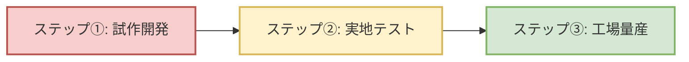

# 🚲 【世界一やさしい】里山シェアサイクル 遠隔バッテリー監視・導入ガイド

このガイドは、専門的なITや電子回路の知識がない非エンジニアの事業者様（あなた）が、**「パナソニックやヤマハの電動自転車を使って、どうやって遠隔でバッテリーと位置を管理するシステムを実際にカタチにするか」**を、日常の言葉や例え話を使って分かりやすく解説したものです。

開発会社や製造工場と打ち合わせをするときに、このガイドを見ながら話すだけで、スムーズに事業を進めることができます。

---

## 🧭 1. このシステムはどうやって動いているの？（全体像）

この遠隔監視システムは、人間で例えると**「自転車の健康状態と居場所を、スマホの電波を使って、管理者のパソコンに定期的にLINEで送ってくる」**ような仕組みです。

必要になるのは、以下の**「3つの主役」**です。

```
[① 自転車のバッテリー] 
       || (電気と情報をもらう)
[② 車載IoT端末（自転車に取り付ける小さな箱）]  ★今回つくるハードウェア
       || (スマホの電波で送る)
[③ 管理者ダッシュボード（こないだ作った画面）]  ★こないだ作ったソフト
```

### 🌟 今回作る「車載IoT端末（小さな箱）」の役割
自転車の「カゴの底」や「ハンドル部分」に取り付ける、名刺入れくらいの大きさの防水の箱です。この箱の中には、以下の**「4つのパーツ」**が入っています。

1.  **電気の翻訳機**: 自転車の強力な電気を、端末が動くための優しい電気に安全に変換します。
2.  **おしゃべり通訳**: パナソニックやヤマハの自転車が話している「バッテリーの残り香」のデータを、端末が理解できる言葉に通訳します。
3.  **GPSアンテナ（居場所キャッチャー）**: 空の上の人工衛星から電波を受け取り、「いま自転車が丹波篠山のどこにいるか」を正確に突き止めます。
4.  **スマホ電波送信機**: 突き止めた位置とバッテリー残量を、山の中でも繋がりやすい特別な電波を使って、あなたのパソコン（サーバー）へ送信します。

---

## 🔍 2. なぜパナソニックとヤマハで設計が違うの？（注意すべきポイント）

自転車のメーカーによって、バッテリーの「話し言葉（通信ルール）」や「接続口の形」が違います。

### ヤマハ（Yamaha）の自転車のポイント
*   **特徴**: とても慎重で、ゆっくり丁寧に喋るような通信（低いスピード）をしています。
*   **🚨 最も注意すること（安全装置のロック）**:
    ヤマハのバッテリーは、防犯と安全のために**ものすごく敏感な防衛システム（頭脳）**を持っています。
    もし、私たちが取り付ける「小さな箱」の配線が外れたり、変な電気が一瞬でも流れたりすると、バッテリーが「泥棒に攻撃された！」と勘違いして、**自分で自分の頭脳にロックをかけて、二度と充電も放電もできなくしてしまいます（永久ロック）**。
    *   **対策**: 開発会社には**「ヤマハのバッテリーがビックリしてロックがかからないように、電気を優しく守る保護回路を絶対に作ってください」**と伝えてください。

### パナソニック（Panasonic）の自転車のポイント
*   **特徴**: 起動するときに、自転車とバッテリーの間で「合言葉（パスワード）」を言い合うような仕組みを持っています。
*   **対策**: 開発会社には**「パナソニックの合言葉（認証）を端末が邪魔しないように、上手に間に入ってデータを聞き取れるプログラムにしてください」**と伝えてください。

---

## 🛠️ 3. 丹波篠山ならではの「過酷な自然」に耐えるための工夫

丹波篠山は、美しい里山である一方、機械にとっては「過酷な環境」です。これを乗り越えるための3つの魔法を端末に施します。

```
【丹波篠山の環境】          【IoT端末に施す3つの魔法】

① 山間部や木造の古い町 ➡️   ◆ 魔法１：みちびき衛星対応の「大きなGPSアンテナ」
   (電波が届きにくい)          日本の真上を通る「みちびき」の電波を強力にキャッチします。

② 激しい寒暖差と霧    ➡️   ◆ 魔法２：中が蒸れない「魔法の通気シール（TEMISH）」
   (箱の中で結露する)          雨や水は絶対に中に入れませんが、空気と湿気だけはスースー
                               逃がします（ゴアテックスの合羽のような仕組み）。箱の中の結露を防ぎます。

③ ガタガタ道や石畳    ➡️   ◆ 魔法３：衝撃を和らげる「防振ゴムグロメット」
   (振動でハンダが割れる)      精密な基板が直接揺れないよう、ネジの隙間に柔らかいシリコンゴムを
                               挟んでフワフワと浮かせ、ハンダが揺れで割れるのを防ぎます。
```

---

## 🔋 4. 自転車が何日も放置されても「バッテリーが上がらない」仕組み

「管理用の端末を取り付けたせいで、自転車のバッテリーが空っぽになって動かなくなった」となっては本末転倒です。

そこで、端末には**「賢い居眠り機能」**を取り付けます。

*   **自転車が動いているとき**: 端末はパチッと目を覚まして、GPSで位置を追いかけ、バッテリー残量をサーバーに送ります。
*   **自転車が停まっているとき（夜間やオフシーズン）**: 端末はほとんど全ての電源を切り、**「深い眠り（ディープスリープ）」**に入ります。この時の消費電力は、スマホの充電の「数万分の一」以下なので、何ヶ月放置してもバッテリーは全く減りません。
*   **どうやって起きるの？**: 端末の中に「揺れを感知する小さなセンサー（加速度センサー）」を仕込んでおきます。誰かが自転車を動かしたり、鍵を開けて揺らしたりした瞬間、センサーが「朝だよ！」とマイコンを起こすため、動き出したときだけ正確に位置を追跡できます。

---

## 📅 5. 実際に運用をスタートするまでの「3つのステップ」

あなたがこのプロジェクトを成功させるための具体的な進め方です。



### 🟥 ステップ①：壊れてもいい「ダミーのバッテリー」で実験する（2〜3ヶ月）
いきなり本物のヤマハやパナソニックの自転車に端末を繋ぐと、前述の「永久ロック」でバッテリーを壊してしまう危険があります。
まずは、開発会社に「本物のバッテリーのフリをして喋るダミーの機械（エミュレータ）」を作ってもらい、安全な机の上で端末が正しくデータを受信できるかテストします。

### 🟨 ステップ②：丹波篠山の現場で「お試しで走らせる」（2〜3ヶ月）
手作りで数台分の「試作機」を作り、テスト車両に取り付けます。
実際にあなたが丹波篠山の山道や城下町を走らせてみて、**「GPSの位置がズレないか」「山の陰でも電波が繋がるか」「雨や朝霧で中が濡れて壊れないか」**を自分の目で確かめます。

### 🟩 ステップ③：量産工場（EMS）に頼んでたくさん作る（3ヶ月〜）
テストが完璧に成功したら、基板やプラスチックの箱を大量に作る専門の工場（EMSベンダー）へ製造を依頼します。
このとき、工場に対して**「出荷する前に、すべての端末に空気圧をかけて、隙間から水が漏れないか（防水テスト）をチェックしてください」**と指示をします。これにより、初期不良をゼロにできます。

---

## 🤝 開発会社や工場へ「そのまま見せる」魔法の言葉リスト

専門的な打ち合わせの際、開発会社に以下のテキスト（または [visual_hardware_guide.md](file:///Users/daisuke/.gemini/antigravity/brain/e57250e0-b24e-4eca-ae20-868d782e6204/visual_hardware_guide.md) のリンク）を見せて、**「この通りに作ってください」**と伝えるだけで、彼らは「この事業者はプロだ」と理解し、手戻りのない正確な設計をしてくれます。

> **💻 開発会社（エンジニア）へ提示する指示内容**
> 1. **電源**: TIの **LM5164-Q1** を使用し、ヤマハ・パナ双方の24V〜36V（サージ耐性80V以上）に対応した降圧回路にしてください。逆接続保護にはMOSFETを使用し、TVSは **5.0SMDJ58A** を入れてください。
> 2. **暗電流**: ディープスリープ時の目標値は **45 µA以下** です。 **LIS2DW12** を用いた Wake-on-Motion 割り込み起動とし、スリープ中の常時給電は **TPS7A02** を採用、メインDCDCはロードスイッチ等で遮断してください。
> 3. **通信・GPS**: **nRF9160-SICA** をメインSoCとし、GPSアンテナには **Taoglas CGGBP.35** パッシブパッチアンテナを採用、感度向上のためSAWフィルタとLNA（**BGA824N6**）をフロントエンドに実装し、主要部はシールド缶でノイズを物理遮断してください。
> 4. **物理・防水**: **PC-ABS (SABIC CYCOLOY C2950)** の筐体、OリングによるIP67防水とし、結露防止用に **日東電工のTEMISH防水通気ベント** を設置。車体接続には **JST JWPF防水コネクタ** を指定します。ハンダクラック防止に防振ゴムグロメットと **SN100C** はんだを使用してください。
