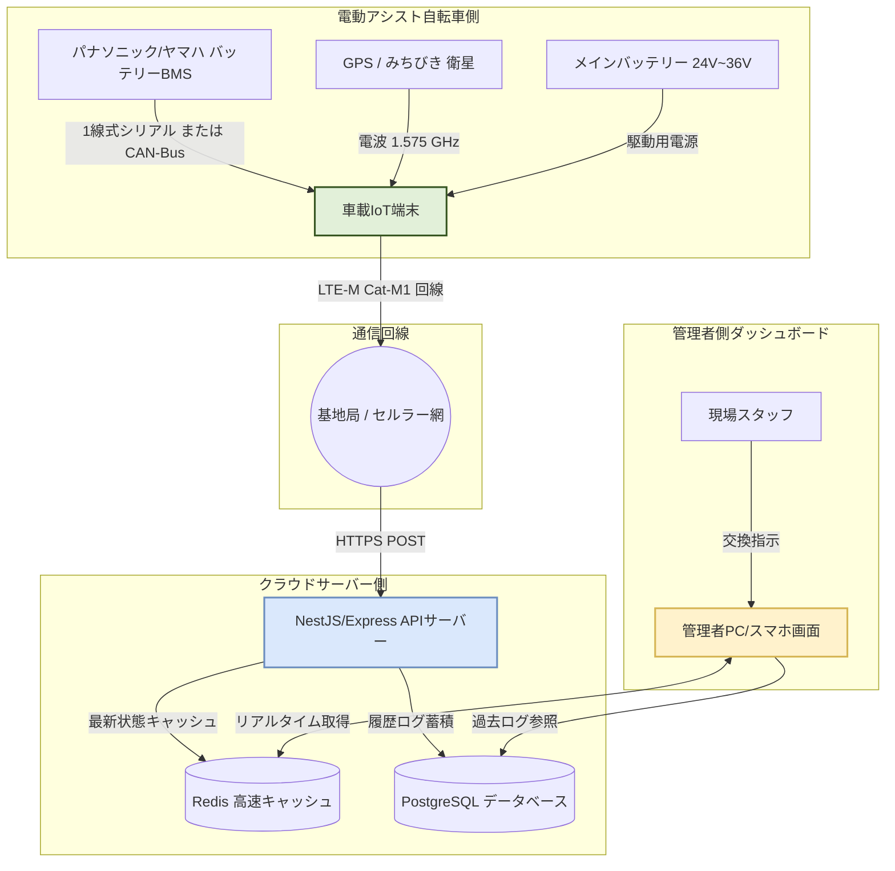
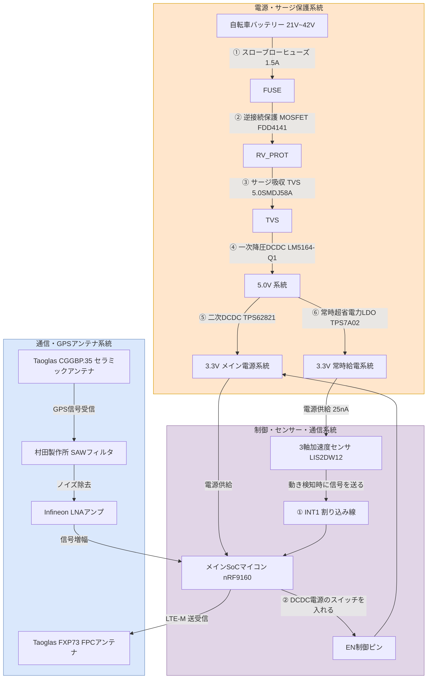
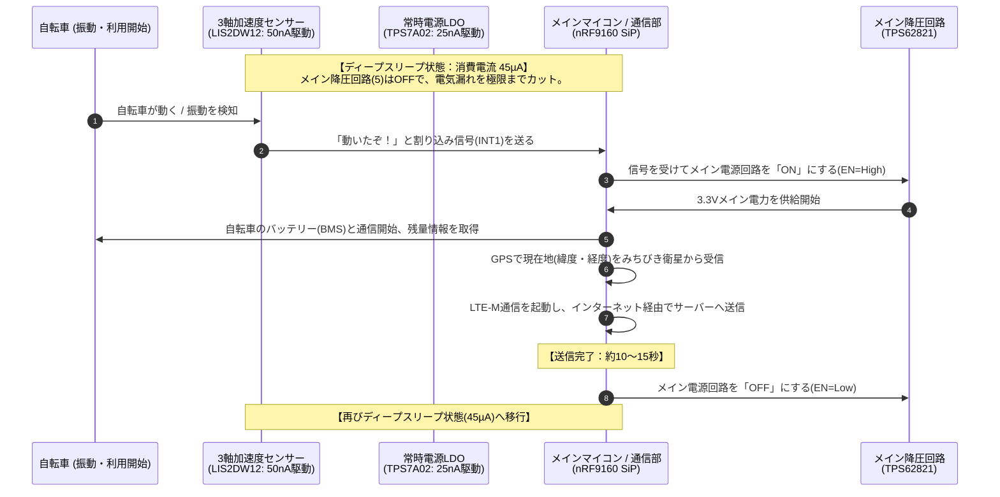

# 🚲 【視覚ガイド】電動アシスト自転車 車載IoT端末 実装・運用ビジュアルブック

本資料は、パナソニックおよびヤマハの電動アシスト自転車に対応する「遠隔バッテリー・位置情報管理システム」のハードウェア構成、通信スタック、および丹波篠山での運用モデルを、図表やMermaidダイアグラムを用いて視覚的に分かりやすくまとめたビジュアルガイドです。

---

## 🌐 1. 全体システムデータフロー（どこがどう繋がるか）

自転車の車載端末がデータを取得し、管理画面に反映されるまでのデータと電気の流れです。



---

## 📊 2. パナソニック vs ヤマハ 通信＆物理仕様 比較表

両社の通信仕様と、開発・製造時に最も注意すべき点を視覚的に比較したマトリクス表です。

| 比較項目 | ヤマハ (Yamaha) 従来シリアル | ヤマハ (Yamaha) 新型CAN | パナソニック (Panasonic) 一般 | パナソニック (Panasonic) FIT (CAN) |
| :--- | :---: | :---: | :---: | :---: |
| **接続ピン数** | **3極 または 4極** | **5極** (平型) | **5極** (NKY底面) | **6極** (丸型防水) |
| **通信物理層** | 1線式 UART (単線) | CAN-Bus (差動2線) | 1線式 UART (単線) | CAN-Bus (差動2線) |
| **通信速度** | 🐌 **2,400 bps** (超低速) | ⚡ **500,000 bps** (高速) | 🐢 **9,600 / 19,200 bps** | ⚡ **250k / 500k bps** (高速) |
| **パリティ/設定**| 8E1 (偶数パリティ) | 標準CANフレーム | 8E1 または 8N1 | CANopen (CiA 301) |
| **データ周期** | 250 ms 周期 | 20ms 〜 500ms 周期 | 100ms 〜 250ms 周期 | 20ms 〜 1000ms 周期 |
| **最大の特徴** | DATAピンに5V印加でBMS起動 | 起動用のWake-up線(ピンク)有 | 起動時に相互認証処理が必要 | 動的Node-ID設定 (LSS) を採用 |
| **🚨 致命的リスク**| **通信異常でBMS永久ロック**<br>（AFE Faultによるレンガ化） | 特になし (パケット途絶注意) | 認証エラーでアシスト停止 | 特になし (終端抵抗120Ω必須) |
| **対応に必要な回路**| 双方向高耐圧保護SBD＋Tr | CANトランシーバ (TCAN1042) | チャレンジレスポンス認証ソフト | CANトランシーバ (TCAN1042) |

---

## 🔌 3. 車載IoT端末の内部回路ブロック図

「何がどこに繋がり、どのように電力を抑えるか」をビジュアル化した基板内のレイアウト図です。



---

## 🔋 4. 超省電力！「Wake-on-Motion」動作シーケンス

自転車が動いていない時はほぼ「ゼロ電力」で眠り、動いた瞬間だけ目覚める省電力の仕組みです。



---

## 🌧️ 5. 筐体の耐候・防水・結露防止 内部断面ビジュアル

丹波篠山の過酷な雨、雪、夏の直射日光、急激な寒暖差に耐える筐体の設計断面図（イメージ）です。

```
【車載IoT端末 物理筐体 断面設計イメージ】

                      [ 天頂方向：上空の視界を確保 ]
                 
                 +-----------------------------------+  <=== 上カバー：PC-ABS樹脂
                 |      [GNSSパッチアンテナ]         |       (電波を通す CYCOLOY C2950)
                 |       (35x35mm大型素子)           |
                 |                                   |
    シリコンゴム  |  ================[ 基板 ]=========  |  <=== 内部基板は防湿コーティング
    Oリングガスケット |  [金属シールド缶]                 |       (Humiseal 1B66で2面塗布)
     (IP67防水) ===> [o]                             [o] |
                 |  [防振ゴムブッシュ]  [防振ゴム]     |  <=== 振動・段差の衝撃(最大10G)を
                 +---|-------------|-------------|---+       グロメットで50%以上吸収・緩和
                 |   |             |             |   |  <=== 下カバー：PC-ABS樹脂
                 +---|-------------|-------------|---+
                     |             |             |
                 +-----------------------------------+  <=== 自転車取付用金属ブラケット
                 |        [防水通気ベント]           |
                 +-----------------------------------+  <=== 日東電工 TEMISH ベント
                              ||||||||                     (水を通さず空気・湿気のみを通し、
                         [ 空気・湿気の往来 ]               内部の「結露」を100%シャットアウト)
```

---

## 📅 6. 運用開始までの4大フェーズとチェックリスト

本システムを丹波篠山の現場へ導入するまでの具体的なマイルストーンとタスクの一覧です。

```mermaid
gantt
    title 本格導入マイルストーン (全11ヶ月工程)
    dateFormat  X
    axisFormat %dヶ月目
    
    section フェーズ1: 試作開発
    BMS通信模擬機(エミュレータ)で机上検証        :active, 0, 2
    試作基板(PCB)＆3Dプリンタ筐体の試作          :active, 1, 3
    
    section フェーズ2: 丹波篠山テスト
    実車テスト(パナ・ヤマハ車)での実地走行       : 3, 5
    山間部GPS精度・通信・結露・振動の評価       : 4, 6
    
    section フェーズ3: 量産化
    EMS(受託製造)選定と部品・金型手配            : 6, 8
    量産基板の実装＆気密リークテスト            : 7, 10
    
    section フェーズ4: 導入・運用
    車体取り付けと運用開始                       : 9, 11
    OTA(回線経由)ファームウェア保守              : 10, 11
```



### 📋 各フェーズの重要チェックリスト

#### ✅ フェーズ 1：試作開発
* [ ] ヤマハ用 `2400bps 8E1` および パナソニック用 `9600bps 8E1` の疑似信号を出すエミュレータを作成したか？
* [ ] ヤマハBMSを永久破壊（AFE Faultロック）させない保護回路が一次試作基板に入っているか？
* [ ] ディープスリープ時の電流が目標の **45 µA以下** を達成できているか？

#### ✅ フェーズ 2：丹波篠山実地テスト
* [ ] 篠山城跡周辺の木造家屋エリアで、GPS位置情報のズレが許容範囲内（5m以内）に収まっているか？
* [ ] 多紀連山付近の山間部において、LTE-M（Cat-M1）の接続が途切れず維持できるか？
* [ ] 冬の早朝に外気が氷点下になった際、筐体内部に水滴（結露）が発生していないか？

#### ✅ フェーズ 3：量産化
* [ ] 大量生産を委託するEMSベンダーの選定と、nRF9160モジュール等の主要部品の確保はできたか？
* [ ] プラスチック筐体の射出成形用金型を起工し、Oリングの圧縮率（25%〜30%）を確保できているか？
* [ ] 出荷前の防水性を保証する**「非破壊エアリーク試験」**ラインを全数検査に組み込んだか？

#### ✅ フェーズ 4：導入・運用
* [ ] 配線が露出して観光客に悪戯されたり、雨風に直接晒されたりしないよう、車体フレーム内に隠蔽配線できたか？
* [ ] ファームウェアのバグ修正や省電力設定を遠隔で書き換える **「OTA機能」** がAPIサーバーと連携して動作するか？
