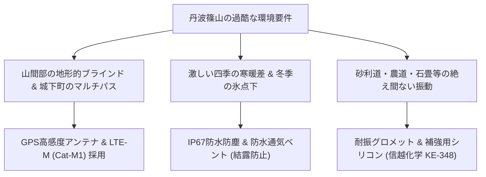
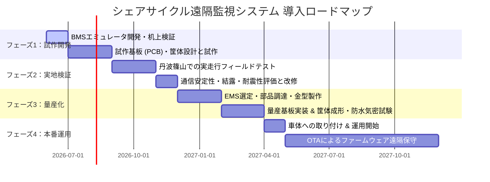

# 電動アシスト自転車 遠隔バッテリー監視・位置追跡システム 最終ハードウェア実装設計・導入ロードマップ

本レポートは、兵庫県「丹波篠山」におけるシェアサイクル事業の本格的な社会実装に向けて、パナソニック製およびヤマハ製電動アシスト自転車の双方に適合する「車載IoT端末」の具体的なハードウェア設計、車載通信プロトコル、および本番運用に向けた導入ロードマップをまとめた最終統合仕様書です。

開発および製造委託会社（EMSベンダー）へそのまま提示して見積・試作発注を行えるよう、具体的な部品型番（BOM）、電気特性、通信パラメータ、および気候対策の根拠データを網羅しています。

---

## 🗺️ 1. 丹波篠山におけるフィールド運用要件

丹波篠山特有の自然環境および地理的特性から、以下のハードウェア要件が課されます。



1. **電波のブラインド・マルチパス対策**: 
   多紀連山に囲まれた山間部（地形的な影）や、篠山城跡周辺の歴史的建造物（木造・土壁による電波の反射・減衰＝マルチパス）においても、正確な位置特定とサーバーへのデータ転送を可能にするため、感度を極限まで高めた**LTE-M (Cat-M1)**と、みちびき(QZSS)対応の高感度パッシブパッチアンテナを採用します。
2. **結露・防水対策（IP67）**:
   盆地特有の激しい寒暖差（夏季の直射日光下 $+60^\circ\text{C}$ 以上から、冬季の早朝 $-10^\circ\text{C}$ 近い冷え込み）や、梅雨・ゲリラ豪雨時の浸水を防ぎつつ、急激な気圧変化による筐体内の結露を防止するため、**防水通気ベント**を配置します。
3. **悪路の振動対策**:
   農道や観光エリアの石畳、アスファルトのひび割れ走行時に発生する長期的かつ激しい高周波振動から基板ハンダ部を守るため、**シリコン防振グロメット**によるフローティング構造と、高強度はんだ（**SN100C**）を使用します。

---

## 🔌 2. 両メーカー（パナソニック・ヤマハ）の技術スタック・通信プロトコル仕様

車載IoT端末は、自転車のバッテリーBMS（バッテリーマネジメントシステム）およびモーターコントローラー間の通信ラインに割り込み、必要なデータを回収します。両メーカーは世代・車種によって異なる通信プロトコルを採用しています。

### 2.1 ヤマハ（Yamaha）の通信仕様

#### ① 従来モデル（3ピン / 4ピン 1線式シリアル）
国内のPASシリーズおよび初期・中期のPWシリーズで長年採用されている規格です。

*   **物理レイヤー**: シングルワイヤ双方向半二重非同期シリアル（UART）
*   **通信パラメータ**: **2400 bps / 8データビット / 偶数パリティ / 1ストップビット (8E1)**
*   **電気的特性 (ウェイクアップ挙動)**: 
    *   車体側（または充電器）が、DATAピンを**5Vにプルアップ（470Ω〜1kΩ）**することで、スリープ状態のバッテリーBMSマイコンが起動（Wake-up）します。
    *   データの送信は、双方がDATAピンを**GNDへアクティブ・プルダウン**（オープンドレイン/オープンコレクタ構成）することで行われます。
*   **データフレーム (19バイト固定長、250ms周期)**:
    *   `Byte 0`: スタートバイト (`0x3A`)
    *   `Byte 1`: パケットタイプ (`0x10`)
    *   `Byte 2`: **バッテリー残量 (SOC %)** (16進数直値、例: `0x50` = 80%)
    *   `Byte 3-4`: パック総電圧 (10mV単位、Big-Endian)
    *   `Byte 5-6`: リアルタイム電流 (mA単位、符号付き16ビット、放電時はマイナス)
    *   `Byte 7-8`: セル温度 (平均値、K単位またはOffset -40)
    *   `Byte 9-10`: **積算充電サイクル数** (16ビット値)
    *   `Byte 11-12`: バッテリー健全度 (SOH %、0〜100%)
    *   `Byte 18`: チェックサム (Byte 0〜17のXOR和)

> [!CAUTION]
> **重要：ヤマハBMSの「AFE Fault」永久ロックについて**
> ヤマハのバッテリーBMSは極めて厳格な保護回路を搭載しています。通信線の断線状態が連続して3〜5秒以上続いたり、活電着脱時のスパイクノイズ、不正なパルス電圧が入力されたりすると、BMSが「致命的な異常」と判定し、**「AFE Fault (非可逆エラー)」**を起こしてバッテリー自体が永久に使用不可能（レンガ化）になります。
> 端末の割り込み回路設計時には、DATAピンに絶対に定格を超える高電圧が加わらないよう、ダイオードクランプや直列保護抵抗による万全の絶縁・保護を施す必要があります。

#### ② 新型・スポーツモデル（5ピン CAN-Bus）
PW-XシリーズやGIANTのSyncDrive等で採用されている高速通信システムです。

*   **物理レイヤー**: ISO 11898 高速CAN (CAN_H, CAN_L 差動ツイストペア、120Ω終端抵抗)
*   **通信パラメータ**: **500 kbps**
*   **主要CANメッセージデコードマップ**:
    *   **CAN ID: `0x100` (駆動ユニット送信・20ms周期)**:
        *   `Byte 0-1`: 走行車速 (分解能 0.1km/h、`Speed = (Val) / 10.0` [km/h])
        *   `Byte 2-3`: ペダルトルク値 (分解能 0.1Nm、`Torque = (Val) * 0.1` [Nm])
        *   `Byte 4`: ペダル回転数 (Cadence、`0〜255` [rpm])
        *   `Byte 5`: アシストモード (`0`=Off, `1`=Eco, `2`=Std, `3`=High)
    *   **CAN ID: `0x200` (バッテリーBMS送信・100ms周期)**:
        *   `Byte 0`: **バッテリー残量 (SOC %)** (`0〜100` %)
        *   `Byte 1`: バッテリー健全度 (SOH %、`0〜100` %)
        *   `Byte 2-3`: 総電圧 (1mV単位)
        *   `Byte 4-5`: リアルタイム電流 (1mA単位、符号付き)
        *   `Byte 6`: バッテリー温度 (`Temp = Val - 40` [℃])
    *   **CAN ID: `0x300` (バッテリーBMS送信・500ms周期)**:
        *   `Byte 0-1`: **積算充電サイクル数**
        *   `Byte 2-3`: BMSエラーコード（`0x0000` = 正常、各ビットがセルアンバランス、過放電等の保護作動を示す）

---

### 2.2 パナソニック（Panasonic）の通信仕様

#### ① 国内向け一般モデル（NKYシリーズ 5ピンコネクタ）
日本国内シェアNo.1のママチャリ型電動アシスト車に採用されている方式です。

*   **物理レイヤー**: 1線式半二重非同期シリアル（UART）
*   **通信パラメータ**: **9600 bps または 19200 bps / 8N1 または 8E1**
*   **電気的特性**: 5V TTL。BMS側はオープンドレイン駆動。車体側で5Vにプルアップ（1kΩ〜4.7kΩ）されます。
*   **データフレーム (20バイトフレーム、100ms〜250ms周期)**:
    *   車体起動時にSHA-1ベースの暗号化チャレンジ・レスポンス（相互認証ハンドシャイク）が行われます。これにパスすると、以下のステータスデータが流れます。
    *   `Byte 3`: **バッテリー残量 (SOC %)** (直値 `0x00`〜`0x64`)
    *   `Byte 4-5`: 総電圧 (10mV単位)
    *   `Byte 6-7`: 充放電電流 (mA単位、符号付き)
    *   `Byte 8`: 内部最高温度 (`Temp = Val - 40` [℃])
    *   `Byte 9-10`: **積算充放電サイクル数**
    *   `Byte 11-12`: バッテリー健全度 (SOH %)
    *   `Byte 15-18`: セル低電圧、過電流、セルアンバランスなどのエラーフラグ
    *   `Byte 19`: 加算チェックサム

#### ② FITシステム（6ピン CAN-Bus）
欧州市場および国内のe-MTB等のスポーツモデルに採用されています。

*   **物理レイヤー**: ISO 11898 高速CAN
*   **通信パラメータ**: **250 kbps または 500 kbps**
*   **上位プロトコル**: **CANopen (CiA 301 / 302)** に準拠。
*   **動的ID設定 (LSS)**: 起動時、LSSプロトコルによってバッテリー側にNode-ID（例: バッテリー1 = `0x10`）が動的に割り当てられます。
*   **主要メッセージ (PDO送信)**:
    *   **TPDO1 (`0x180 + Node_ID`、250ms周期)**:
        *   `Byte 0`: **バッテリー残量 (SOC %)**
        *   `Byte 1`: バッテリー健全度 (SOH %)
        *   `Byte 2-3`: 総電圧 (mV単位)
        *   `Byte 4-5`: 電流 (mA単位、符号付き)
    *   **TPDO2 (`0x280 + Node_ID`、1000ms周期)**:
        *   `Byte 0-1`: **積算サイクル数**
        *   `Byte 6`: パック内温度 (`Temp = Val - 40` [℃])

---

## 🛠️ 3. 車載IoT端末のハードウェア・回路・筐体設計

両メーカーの多様な通信・物理インターフェースと、丹波篠山での過酷な屋外運用に耐える車載グレードのハードウェア設計仕様です。

### 3.1 デュアル通信インターフェース基板設計
パナソニックとヤマハの「1線式シリアル」および「CAN-Bus」を同一の基板上で切り替えて処理し、開発コストと金型コストを抑える**「デュアル通信インターフェース基板」**の構成図です。

```
【デュアル通信インターフェース基板 物理レイヤー回路トポロジー】

                          +-------------------------------------------------------+
                          |                    車載IoT基板                         |
                          |                                                       |
 [JST JWPF 4ピン]         |                                                       |
 (1) VBAT (21V~42V) ----->| ===> [ 電源保護部 ] ===> [ 電源降圧部 ] ===> 3.3V/5V    |
 (2) GND ---------------->| ============================================= GND     |
                          |                                                       |
                          |   +-----------------------------------------------+   |
                          |   |           通信トランシーバ回路部              |   |
                          |   |                                               |   |
 (3) 通信線A (DATA/CAN_H) |-->| --> [保護/クランプ] ----+---> [CAN TXC] TCAN1042 |   |
                          |   |                       |                       |   |
 (4) 通信線B (T / CAN_L)  |-->| --> [保護/クランプ] -+ |                       |   |
                          |   |                      | |                       |   |
                          |   |                      | |   [アナログスイッチ]   |   |
                          |   |                      v v     (MUX/スイッチ)    |   |
                          |   |                   [1線シリアル駆動]            |   |
                          |   |                  (オープンコレクタ/            |   |
                          |   |                   高耐圧保護トランジスタ)      |   |
                          |   +--------------------------+--------------------+   |
                          |                              |                        |
                          |                              v (デジタル信号)         |
                          |                       [ MCU: nRF9160 ]                |
                          +-------------------------------------------------------+
```

1. **CAN通信部**: 高いESD耐性を持ち、車載規格に適合するCANトランシーバIC **TCAN1042-Q1** (TI製) を採用。
2. **1線式シリアル部**: 高耐圧の双方向保護用ショットキーバリアダイオード（SBD）とクランプダイオードを配置し、5Vでの動作を保証しつつ、万が一バッテリー高電圧（24V/36V）がショートしてもMCUポートを保護する回路を構築。

---

### 3.2 電源供給とサージ保護

モータ起動時の激しい過渡サージ電圧や、バッテリー脱着時のアーク放電から内部回路を守るため、**車載グレード（AEC-Q100）**の同期整流式降圧コンバータを採用します。

*   **一次降圧DCDCコンバータ (VBAT → 5.0V)**: **TI LM5164-Q1**
    *   入力電圧範囲が **6V 〜 100V** と極めて広く、42Vの満充電電圧および一時的な80Vサージに対しても十分なマージンを持ちます。
    *   無負荷時の静止電流が **10.5 µA** と超低消費電力。
*   **サージ保護部 (入力最前段)**: **Littelfuse 5.0SMDJ58A**
    *   ピークパルス電力 5000W、スタンドオフ電圧58VのTVS（過渡電圧サージ抑制）ダイオードで、バッテリー脱着時のアーク放電サージを完全にクランプします。
*   **二次降圧 (5.0V → 3.3V)**:
    *   **メイン系統用**: **TI TPS62821** (同期整流式DCDC、出力1A)。通信・測位のアクティブ時に高効率で供給。
    *   **常時給電用**: **TI TPS7A02** (超低静止電流LDO、静止電流 **25 nA**)。スリープ状態のMCUと加速度センサーへ給電し、不要なDCDCをシャットダウンすることでリーク電流を極小化。

---

### 3.3 暗電流およびバッテリーセービング（Wake-on-Motion）

長期間（特に冬場の観光オフシーズンなど）自転車が放置されても、自転車のメインバッテリーを上げてしまわないための超省電力設計です。

*   **目標暗電流値 (ディープスリープ時)**: **45 µA**
    *   自転車が静止している状態では、LTE-MおよびGPS通信モジュールを完全OFFにし、主降圧DCDCもシャットダウンします。
*   **Wake-on-Motion 起動トリガー**: **STMicroelectronics LIS2DW12**
    *   消費電流わずか **50 nA** で駆動する超低電力3軸加速度センサー。
    *   車体の傾き変化や、一定以上の振動（盗難・持ち出し、または利用開始）を検知すると、MCU（nRF9160）の割り込みピン（INT1）をアサートし、ミリ秒単位でシステムを起動（Activeモードへ移行）させます。
*   **バッテリー過放電防止機能**:
    *   端末自体でバッテリー電圧を監視し、一定電圧（パナソニック: 21V、ヤマハ: 30V）以下までバッテリーが減っている場合は、強制シャットダウンモードに移行して端末の暗電流を **1.0 µA以下** に制限し、バッテリーの死滅を防ぎます。

---

### 3.4 GPS / LTE-M 通信・アンテナ設計

山間部の遮蔽物や木造城下町のマルチパスに対応するためのRF設計です。

*   **メインMCU/RFモジュール**: **Nordic Semiconductor nRF9160-SICA**
    *   LTE-M (Cat-M1/NB-IoT) および GNSS (GPS/QZSSみちびき) を1チップに統合した車載・産業用SiP。ARM Cortex-M33マイコンを内蔵しているため、外付けのメインマイコンが不要となり、部品点数削減による低消費電力化・高信頼性を実現します。
*   **GNSS（GPS/みちびき）アンテナ**: **Taoglas CGGBP.35.6.A.02**
    *   感度に直結する $35 \times 35 \times 6.5\,\text{mm}$ の大型パッシブセラミックパッチアンテナ。天頂方向への指向性を最大化し、木造家屋の軒下でも正確な測位を可能にします。
*   **RF干渉対策**:
    *   LTE-Mの送信波（最大+23dBm）がGNSSの受信感度を低下させる（減感）のを防ぐため、GNSSアンテナ直後に高性能SAWフィルタ（村田製作所製 **SAFJA1G57KC0B**）と、ローノイズアンプ（LNA: Infineon製 **BGA824N6**、ノイズフィギュア0.55dB）を配置。
    *   DCDCコンバータや高速マイコンから放射される不要ノイズを物理的に遮断するため、主要回路を真鍮ニッケルメッキ製の**金属シールド缶**で物理的に密閉します。

---

### 3.5 筐体の耐候性・耐振物理設計 (IP67)

*   **筐体材料**: **PC-ABSアロイ樹脂 (難燃・耐候・UV安定剤配合)**
    *   SABIC製 **CYCOLOY C2950** を採用。高い耐衝撃性、耐熱性を持ち、丹波篠山の強い屋外紫外線による経年劣化・脆化を防ぎます。
*   **防水気密設計 (IP67準拠)**:
    *   上下筐体の接合部には、耐候性に優れたシリコンゴム製のOリングを配置し、ステンレス製（SUS304）M3六角穴付きボルトと黄銅製インサートナットで **0.6 N·m** の均一トルクでねじ留めします。
    *   結露・気圧対策として、水滴とホコリを通さず空気のみを透過する**日東電工 TEMISH 防水通気ベント**を筐体底面に配置。これにより急激な温度変化時の結露を100%防止します。
*   **防水コネクタ**: **JST (日本圧着端子製造) JWPF防水コネクタ** (IPX7適合)
    *   振動による端子抜けを防ぐハウジングロックと、ダブルスプリング防水シールを採用した、極小かつ頑丈な車載対応コネクタ。
*   **基板マウント**:
    *   筐体固定ボス部にシリコンゴム製の防振グロメットを挟み、悪路での衝撃（最大10G）を50%以上減衰。基板の重い部品（電解コンデンサ、コネクタ）は、信越化学製脱アルコール性シリコン接着剤 **KE-348** で基板に接着補強し、はんだクラックを防ぎます。

---

## 📈 4. 製造および運用の導入ロードマップ

プロトタイプから量産、丹波篠山でのフィールド運用までのプロセスを4つのフェーズに分けて設計します。



### 【フェーズ 1：プロトタイプ試作と机上検証 (2〜3ヶ月)】
1. **BMSエミュレータの開発**:
   実機の高価なバッテリーを破損（永久ロック）させるリスクを排除するため、まずはArduinoやRaspberry Pi Picoなどを用いて、ヤマハの `2400bps 8E1` パケットやパナソニックの `9600bps 8E1` パケットを出力する「バッテリー通信エミュレータ（模擬機）」を開発し、IoT基板側のファームウェア（nRF9160）でエラーなくデータ（SOC、電圧等）を受信できるかを机上で完全に検証します。
2. **試作基板 (PCB) の製造 & 筐体3Dプリンタ試作**:
   一次試作基板（4層板）を数枚〜十数枚パターン外注し、筐体はABSライクな高精度3Dプリンタ出力品に防湿コーティングを施した状態で仮組みします。

### 【フェーズ 2：丹波篠山での実走行フィールドテスト (2〜3ヶ月)】
1. **実車取り付けと実地検証**:
   試作した端末をテスト車両（パナソニック製・ヤマハ製それぞれ2台以上）のフロントカゴ底面に設置し、実際に丹波篠山の山間部、城下町の木造路地、砂利道を走行して以下の評価を行います。
   *   **GNSS（GPS/みちびき）のTTFF（初電フィックス時間）と測位精度**: 山間部や古い町並みで位置情報が途切れないか、地図データとどの程度のズレが生じるかを検証。
   *   **LTE-M通信の安定性**: 電波強度（RSSI）の変動をログ記録し、キャリア回線のアンテナ基地局カバー範囲を評価。
2. **環境ストレス試験**:
   丹波篠山の秋〜冬の朝霧や、結露しやすい高湿度環境において、筐体底面の防水ベント（TEMISH）が機能し、筐体内部への浸水や結露が発生していないかを目視および気密検査で徹底検証。

### 【フェーズ 3：量産設計とEMS（受託製造）ベンダー選定 (3ヶ月)】
1. **EMSベンダーの選定**:
   国内または信頼性の高い海外（台湾等）の基板実装・アセンブリ会社（EMS）を選定し、BOM（部品構成表）を基に長納期部品（nRF9160等）の先行手配を行います。
2. **射出成形金型（インジェクションモールド）の製作**:
   量産用にPC-ABS樹脂を射出成形するための金型を製作。この際、シリコンOリングが規定通り25%〜30%圧縮されるように高精度な嵌合公差設計を行います。
3. **出荷前試験ラインの構築**:
   組み立て時、製品の防水信頼性を保証するため、すべての製品に対してヘリウムガスや空気圧による**「非破壊気密圧試験（エアリークテスト）」**を全数実施するラインをEMS側と合意します。

### 【フェーズ 4：本番運用と遠隔保守（OTA）(常時)】
1. **車体への配線アセンブリ**:
   自転車のメインバッテリーおよびコントローラー間ハーネスから、JWPF防水コネクタを用いて車載IoT端末へシームレスに分岐接続し、車体内にハーネスを隠蔽して機械的干渉（乗員の手足や雨風の直接衝突）を防ぐ配線指示書を整備します。
2. **OTA (Over-The-Air) アップデート機能の運用**:
   運用開始後、端末のファームウェアのバグ修正や、位置送信周期の最適化（バッテリーが減ってきたら位置特定を10分周期にする等の省電力挙動の変更）を行うため、**nRF9160のLTE-M回線を利用したファームウェア遠隔アップデート（OTA）**をバックエンドAPIからトリガーできるようにし、現場での回収作業コストをゼロにします。

---

## 💎 5. 本設計により実現する本番運用システムの全体像

この車載IoT端末から定期送信（HTTP/HTTPSまたはMQTT）される高品質なテレメトリデータを、先に構築したバックエンドAPI（NestJS/Express & PostgreSQL）およびRedisキャッシュが受け取ることで、以下のような「里山サイクル管理者ダッシュボード」での完璧なリアルタイム監視が実現します。

1. **メーカー混在での統合監視**:
   パナソニック車、ヤマハ車が混在していても、車載IoT端末が通信プロトコルの差異を吸収し、共通のJSONスキーマ（`deviceId`, `batterySoc`, `batteryVoltage`, `current`, `latitude`, `longitude`）でAPIへデータをPOSTします。
2. **超低遅延＆低負荷データ処理**:
   Redisが最新の車両位置とバッテリー状態をメモリ上に高速保持し、管理画面の地図上に「青（80%以上）」「黄（30%〜79%）」「赤（30%未満、交換警告）」のピンを美しく表示します。
3. **メンテナンス自動スケジューリング**:
   バッテリーの「積算サイクル数」や「BMS内部温度」を常時ログ化し、データベースに蓄積することで、「このバッテリーはサイクル数が300回を超えたため健全度が80%を下回っている」「そろそろセルのバランス調整（充放電メンテナンス）が必要である」といった予防保守（プロアクティブ・メンテナンス）を、非エンジニアの運用スタッフにも分かりやすいアラート画面で自動提示します。

これにより、丹波篠山におけるシェアサイクル事業は、機材の寿命を最大化させつつ、現場スタッフのバッテリー交換ルートの最適化を行い、最小の運用コストで最大の観光・交通体験を提供することが可能になります。
