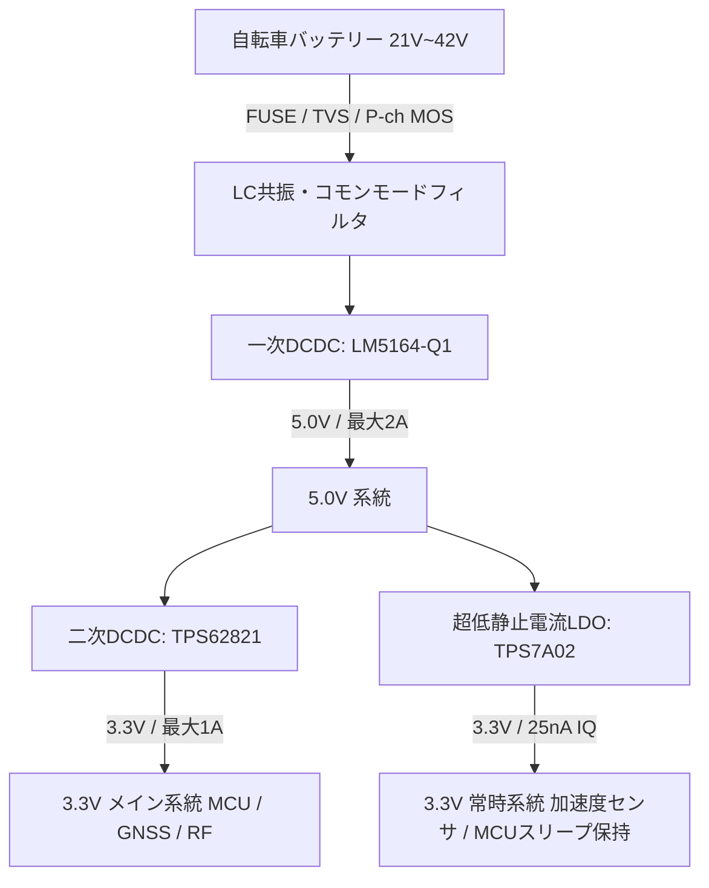
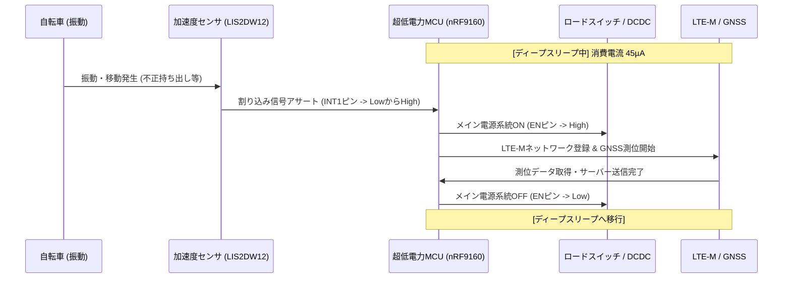

# 電動アシスト自転車向け車載IoT端末 ハードウェア設計仕様書
## (パナソニック・ヤマハ電動アシスト自転車対応 遠隔バッテリー監視＆位置追跡デバイス)

---

## 1. システム概要

本仕様書は、シェアサイクルおよび商用電動アシスト自転車（パナソニック・ヤマハ製）に後付けまたは内蔵し、遠隔からのバッテリー残量監視、車両位置追跡（GPS）、盗難検知等を行う「車載IoT端末」のハードウェア・回路・筐体設計仕様である。

丹波篠山のような「寒暖差が激しい山間部」「木造建築が密集する城下町」「石畳や農道などの悪路走行」という過酷な環境下においても、10年以上の連続運用に耐えうる高信頼性、超省電力性、および堅牢性を実現するための具体的な設計案を示す。

---

## 2. 電源供給設計 (Power Supply & Circuit Design)

自転車のメインバッテリーから直接給電を受け、高効率かつノイズの極めて少ない電圧に降圧する電源回路を設計する。

### 2.1 入力電源条件と保護回路
パナソニックおよびヤマハの電動アシスト自転車は、リチウムイオンバッテリーのセル構成が異なるため、入力電圧範囲が広い。

| 項目 | パナソニック仕様 | ヤマハ仕様 | 設計共通仕様 |
| :--- | :--- | :--- | :--- |
| **バッテリーセル数** | 7直列 (7S) | 10直列 (10S) | **7S〜10S対応** |
| **公称電圧** | 25.2 V | 36.0 V | **25.2 V 〜 36.0 V** |
| **満充電電圧** | 29.4 V | 42.0 V | **最大 42.0 V** |
| **放電終止電圧** | 21.0 V | 30.0 V | **最小 20.0 V** |
| **許容入力電圧範囲** | — | — | **9.0 V 〜 60.0 V** (サージ耐性80V以上) |

#### サージ保護回路 (Front-End Protection)
モータの急起動・急停止時、回生ブレーキ動作時（該当車種の場合）、あるいはバッテリー着脱時のアーク放電により、電源ラインには激しい高電圧サージ（最大60V〜80V）および逆起電力が生じる。これらから後段の回路を保護するため、入力部に以下の保護回路を設ける。
1. **ヒューズ**: 1.5A / 125V 遅延型（スローブロー）表面実装ヒューズ。
2. **逆極性保護**: P-channel MOSFET（例: ON Semiconductor **FDD4141**、耐圧40V・低Rds(on)）またはショットキーバリアダイオード（SBD）による逆接続保護。本設計では損失を極小化するため、耐圧80VのP-ch MOSFETを採用。
3. **サージアブソーバ (TVSダイオード)**: Littelfuse製 **5.0SMDJ58A**（スタンドオフ電圧58V、クランプ電圧93.6V、ピークパルス電力5000W）を入力最前段に配置し、過渡電圧をクランプする。

### 2.2 DCDCコンバータ回路設計
端末のメイン駆動電圧として **5.0V**（LTE通信モジュール送信時のピーク電流用）および **3.3V**（MCU、GNSS、センサー群用）を生成する。



#### ① 一次降圧DCDCコンバータ (VBAT → 5.0V)
- **採用IC**: Texas Instruments製 **LM5164-Q1**
  - **選定理由**: 
    - 入力電圧範囲が **6V 〜 100V** と非常に広く、42Vのヤマハ満充電時や過渡的な高圧サージに対しても十分なディレーティングを確保できる。
    - 静止電流（無負荷時 $I_Q$）がわずか **10.5 µA** と極めて低く、待機時の電力消費を抑えられる。
    - 車載規格（AEC-Q100 Grade 1）に準拠しており、動作温度範囲が $-40^\circ\text{C}$ から $+125^\circ\text{C}$ と丹波篠山の冬期の厳冬環境にも適合する。
    - 同期整流方式のため、高電圧入力（36V）から5Vへの降圧でも85%以上の高効率を維持できる。
- **インダクタの選定**: Coilcraft製 **XAL7070-103ME** ($10\,\mu\text{H}$、直流抵抗 DCR = $18.2\,\text{m}\Omega$、自己温度上昇電流 8.0A)。シールド構造で放射ノイズが非常に小さく、高周波特性に優れる。

#### ② 二次降圧DCDC/LDOコンバータ (5.0V → 3.3V)
- **メイン用 (通信・測位アクティブ時)**: Texas Instruments製 **TPS62821** (同期整流降圧、出力1A、静止電流4µA)。高効率で3.3Vメイン系統へ給電。
- **常時給電用 (ディープスリープ時)**: Texas Instruments製 **TPS7A02** (超低静止電流LDO、静止電流 **25 nA**、最大200mA)。スリープ中の超低消費電力MCUと加速度センサーに給電。スリープ時はTPS62821をシャットダウン（EN=Low）することで、回路全体のリーク電流を極小化する。

### 2.3 熱対策および基板放熱設計
高入力電圧（42V）から5Vへの降圧時、軽負荷時は効率が高いが、LTE-M通信時のピーク電流（最大1.5A）発生時には一時的に損失が発生する。
- **多層基板の採用**: FR-4、4層基板（銅箔厚: 外層 $35\,\mu\text{m}$、内層 $35\,\mu\text{m}$）を採用。
- **GNDプレーンの配置**: 第2層および第4層をベタGNDとし、LM5164-Q1のサーマルパッド直下に $0.3\,\text{mm}$ 径のサーマルビアを9個（3x3格子配列）配置し、第2層のインナーGNDプレーンへ効率的に熱を逃がす。
- **インダクタおよびダイオードの放熱面積**: パターン幅を十分に広く取り、熱抵抗を極小化する。

### 2.4 ノイズ対策 (EMC・EMI)
自転車側のスピードセンサーやトルクセンサー、コントロールユニットへの電波干渉を防ぎ、同時にモータ駆動インバータからの高周波ノイズが本端末のGPS受信感度を低下させるのを防ぐ。
- **入力フィルタ**:
  - DCDC前段にコモンモードチョークコイル（TDK製 **ACM4520-900-2P**）と、フェライトビーズ（村田製作所製 **BLM31PG601SN1L**）によるパイ型 $\pi$ フィルタを挿入。
- **スイッチングノイズの抑制**:
  - LM5164-Q1のスイッチング周波数は約 **400 kHz** に設定し、AMラジオ帯帯域への直接干渉を回避する。
  - スイッチングノードの立ち上がりを適度に鈍らせるためのゲートダンピング抵抗（$2.2\,\Omega$）をブートストラップ回路に挿入（効率低下と放射ノイズ低減のトレードオフを考慮）。
  - 出力側には、等価直列抵抗（ESR）が極めて低い積層セラミックコンデンサ（MLCC、村田製作所製 $22\,\mu\text{F}$ x 2）と、高周波ノイズ吸収用に高分子コンデンサ（パナソニック製 OS-CON、 $100\,\mu\text{F}$）を併用。

---

## 3. 暗電流およびバッテリーセービング (Low Power Architecture)

長期間（冬場など）自転車が屋外駐輪場に放置されても、自転車のメインバッテリーを過放電（「バッテリー上がり」）させないため、待機時の暗電流を極限まで低減する。

### 3.1 動作状態と消費電流目標値

| モード名 | 状態詳細 | 主要稼働デバイス | 消費電流 (Typ.) | 電源系統制御 |
| :--- | :--- | :--- | :--- | :--- |
| **アクティブ (通信/測位)** | LTE-M送信、GNSS測位実行中 | MCU, LTE-M, GNSS, センサ | **80 mA** (ピーク時 1.5A) | 全系統ON |
| **スタンバイ (待機時)** | LTE-MはeDRX待受け、GNSS停止 | MCU (低クロック), LTE-M | **2.5 mA** | メイン3.3V ON / 5V ON |
| **ディープスリープ (駐輪時)** | 通信停止、動き検知待ち（常時） | 加速度センサ、MCUスリープ | **45 µA** | メイン3.3V/5V OFF、LDO経由のみ |
| **シャットダウン (過放電保護)** | バッテリー電圧低下時、完全遮断 | なし（自己放電のみ） | **< 1 µA** (ロードスイッチ遮断) | DCDC自体を停止、または切断 |

### 3.2 超省電力制御トポロジー（Wake-on-Motion）
スリープからの復帰には、タイマーによる間欠起動と、車体の移動・振動をトリガーとする「Wake-on-Motion」を組み合わせる。



- **加速度センサー**: STMicroelectronics製 **LIS2DW12**
  - **特長**: 
    - 静止時の消費電流がわずか **50 nA**（1.6 Hz ODR時）。
    - 独立したプログラム可能な割り込みピン（INT1/INT2）を持ち、特定の閾値以上の加速度（振動や傾き変化）を検知すると、MCUに割り込み信号を送信可能。
- **パワーゲート回路**:
  - MCU（nRF9160の内蔵マイコン）がディープスリープ中に周辺デバイス（GNSSアンテナ用LNA、温度センサー等）への給電を完全に遮断するため、ロードスイッチ（Texas Instruments製 **TPS22919**、リーク電流最大0.1µA）を各電源ラインに挿入する。

### 3.3 バッテリー過放電防止機能 (Battery Protection Cut-off)
自転車側のバッテリーが完全放電するのを防ぐため、端末側で「強制シャットダウン電圧閾値」を設ける。
- **電圧測定**: 抵抗分圧回路（高抵抗 $1\,\text{M}\Omega + 100\,\text{k}\Omega$ を使用し、測定時以外はゲートを閉じるMOSFETスイッチを配置してリーク電流を防止）を介してメインバッテリー電圧を常に監視。
- **シャットダウン閾値**:
  - パナソニック（公称25.2V）: 入力電圧が **21.0 V** 以下に低下した場合
  - ヤマハ（公称36V）: 入力電圧が **30.0 V** 以下に低下した場合
  - この閾値に達すると、MCUはすべての通信を停止してシャットダウンシーケンスに入り、自らのDCDCコンバータの `EN` ピンを固定Lowにラッチするか、またはラッチアップ型の超低リーク遮断回路により、暗電流を **1.0 µA以下** に制限し、バッテリーの過放電死を防ぐ。

---

## 4. GPS/LTE-M 通信およびアンテナ設計 (RF & Antenna Design)

丹波篠山における「深い山間部（地形的なブラインド）」や「城下町の古い木造家屋密集地（マルチパス）」でも、抜群の位置精度と通信の安定性を維持するための高周波設計。

### 4.1 通信・測位モジュールの選定
- **選定モジュール**: Nordic Semiconductor製 **nRF9160-SICA** (SiP)
  - **選定理由**:
    - **LTE-M (Cat-M1/NB-IoT) および GNSS (GPS/QZSSみちびき/GLONASS)** を1パッケージに統合した世界最小クラスのSiP。
    - 日本国内の主要キャリア（docomo, KDDI, SoftBank）のLTE-Mバンド（B1/B3/B8/B18/B19/B26）に完全対応。
    - アプリケーションプロセッサとして ARM Cortex-M33（TrustZone搭載）を内蔵しており、外付けのメインマイコンが不要になるため、部品点数削減による低消費電力化と基板フットプリントの最小化に寄与する。
    - 受信感度: LTE-Mで **-108 dBm**、GPSで **-162 dBm** (トラッキング時) と極めて優秀。

### 4.2 アンテナの選定と仕様
LTE-M用とGNSS用に、それぞれ最適なアンテナを選定する。

#### ① LTE-Mアンテナ
- **選定アンテナ**: Taoglas製 **FXP73.07.0100A** (FPC貼付型マルチバンドフレキシブルアンテナ)
  - **仕様**: 700MHz〜2.5GHz対応、寸法 $83 \times 22 \times 0.1\,\text{mm}$、利得約2.5dBi。
  - **採用理由**: 筐体内部の非金属カバー裏面に直接貼り付け可能なため、基板上のフットプリントを圧迫せず、自転車金属フレームからのクリアランスを取りやすい。

#### ② GNSSアンテナ
- **選定アンテナ**: Taoglas製 **CGGBP.35.6.A.02** (パッシブ セラミックパッチアンテナ、 $35 \times 35 \times 6.5\,\text{mm}$) または小型アクティブパッチアンテナ。
  - **仕様**: GPS/GLONASS/Galileo/みちびき(QZSS)対応。
  - **採用理由**: 山間部や木造家屋の軒下といったGPS信号が極めて弱いエリア（マルチパス環境）では、セラミックパッチアンテナのサイズが感度に直結する。最低でも $25 \times 25\,\text{mm}$、スペースが許せば $35 \times 35\,\text{mm}$ の天頂方向指向性の強いパッチアンテナを使用し、受信利得を高める。

### 4.3 物理配置および電波干渉対策 (Coexistence Design)
自転車は金属（アルミまたはクロモリ鉄鋼）のフレームで構成されており、乗員（人体：電波を吸収・減衰させる）が密着するため、アンテナの配置には細心の注意が必要である。

```
【推奨設置位置：フロントバスケット下、またはハンドルステム前方】

            [ 筐体上カバー：PC-ABS (電波透過材料) ]
   +---------------------------------------------------+
   |  [GNSSパッチアンテナ]               [LTE-M FPCアンテナ] |
   |  (天頂方向に障害物なし)              (筐体側面に貼付)     |
   |                                                   |
   |   =================[ 基板 (PCB) ]================ |
   |   [金属シールド缶 (DCDC/MCUノイズ遮断)]               |
   +---------------------------------------------------+
   |                 [ 防振ゴムマウント ]                |
   +---------------------------------------------------+
                            |
                     [ 自転車金属ブラケット ]
```

1. **配置箇所**: 
   - サドル下は乗員の太ももや体躯によって上空が遮られるため不可。**「フロントバスケット（前カゴ）の底部または前面」**、もしくは**「ハンドルステム前方」**の非金属エリアに筐体を配置する。
2. **基板クリアランス**:
   - アンテナ素子は、自転車の金属ブラケットやフレームから最低 **15 mm以上**（好ましくは20mm以上）離して固定する。
3. **GNSSフロントエンドのノイズ対策**:
   - LTEの送信波（最大+23dBm）がGNSSの受信帯域（1.575GHz）へ回り込み、感度を抑圧するのを防ぐため、GNSSアンテナ直後に高性能SAWフィルタ（村田製作所製 **SAFJA1G57KC0B0R**）と、ローノイズアンプ（LNA: Infineon製 **BGA824N6**、ノ益0.55dB）を配置。これによりブロッキングを完全に防ぎ、弱電界地域でのファーストフィックス時間（TTFF）を短縮する。
4. **シールド缶の設計**:
   - 高効率DCDCコンバータ（LM5164-Q1）およびnRF9160 SiPの周囲は、真鍮ニッケルメッキ製の金属シールド缶（ Laird製シールドクリップとカバーの2ピース構造）で覆い、基板内高周波ノイズがアンテナへ結合するのを物理的に遮断する。

---

## 5. 筐体の耐候性・耐振物理設計 (Mechanical & Environmental Design)

丹波篠山の厳しい自然環境（豪雨、降雪、冬期 $-10^\circ\text{C}$ から夏期直射日光下の $+60^\circ\text{C}$ 以上の過酷な温度変化）および、ガタガタ道走行時の激しい振動に耐えうる物理構造。

### 5.1 筐体材料
- **選定材料**: **PC-ABSアロイ樹脂 (難燃・耐候グレード)**（例: SABIC製 **CYCOLOY C2950** または 帝人製 **MULTILON T-3714**）
  - **特性理由**:
    - **ポリカーボネート (PC)** の持つ高い耐衝撃性、耐熱性（熱変形温度 $100^\circ\text{C}$ 以上）と、**ABS樹脂** の成形性・耐薬品性を併せ持つ。
    - 屋外紫外線による黄変や脆化を防ぐため、**UV安定剤（紫外線吸収剤）**を最適配合。
    - 使用可能温度範囲: $-40^\circ\text{C} \sim +85^\circ\text{C}$ を確保。

### 5.2 防水防塵設計 (IP67準拠)
雨天時の走行だけでなく、高圧洗車やゲリラ豪雨での一時的な水没にも耐えるIP67構造とする。
- **ガスケット設計**:
  - 上下筐体の接合部には、耐候性・耐薬品性に優れた **シリコンゴム（またはEPDM）製の成形Oリング** を使用。
  - ガスケットの溝設計は、締め付け時にガスケットが **25%〜30%** 均等に圧縮されるように設計し、長期的なへたり（クリープ）を防ぐ。
- **ネジ留め構造**:
  - タッピンネジは樹脂ボスを割りやすく経年で緩むため使用しない。下カバーに **黄銅製インサートナット（M3）** を熱圧入（またはアウトサート成形）し、上カバーから **ステンレス製（SUS304）M3六角穴付きボルト** で均一に締め付ける（推奨締付トルク: $0.6\,\text{N}\cdot\text{m}$）。対角順での締付を製造指示書に明記。
- **内外部の気圧調整 (結露対策)**:
  - 急激な温度変化（夏のゲリラ豪雨による急冷など）により筐体内部が陰圧になり、Oリングの微細な隙間から水を吸い込む現象を防ぐため、日東電工製 **TEMISH (テミッシュ) CAPSEAL** または W. L. Gore製 **防水通気ベント** を筐体底面に1箇所設置する。空気を通し、水滴やホコリ（IP6X）を完全にシャットアウトする。

### 5.3 防水コネクタの選定

```
【電源・信号用 コネクタ接続仕様】
[ 自転車側ケーブル ] <== (防水) ==> [ 端末筐体壁面：JST JWPFパネルマウント ] -> [ 基板(PCB) ]
```

自転車車体側の電源ハーネスおよびCAN/シリアル信号線との接続用には、実装面積と信頼性のバランスから以下のコネクタを選定する。
- **選定コネクタ**: **JST (日本圧着端子製造) 製 JWPFコネクタ**
  - **型番（基板側ヘッダー）**: **B03B-JWPF-SK-R** (3極) / **B04B-JWPF-SK-R** (4極)
  - **型番（ケーブル側ハウジング）**: **03R-JWPF-VSLE-S** / **04R-JWPF-VSLE-S**
  - **防水等級**: JIS C 0920 IPX7 (防浸型) 適合。
  - **特長**: 極小ピッチ（$2.0\,\text{mm}$）でありながら、ダブルスプリング構造の防水インナーシールを備え、振動による端子抜け（ハウジングランス構造）や接触不良（嵌合ロック付）に対して非常に強い。

### 5.4 防振・耐振設計 (Anti-Vibration & Shock Protection)
石畳や農道での絶え間ない高周波振動および、段差乗り上げ時の最大 10G 以上の衝撃から基板部品を保護する。
- **基板取付部**:
  - 筐体内部の基板固定ボス部には、シリコンゴム製の **防振グロメット**（例: タキゲン製または栃木屋製防振ゴムブッシュ）を挟み込んでねじ留めし、基板に伝わる衝撃加速度を 50% 以上減衰させる。
- **部品補強**:
  - 基板上の背の高い重い部品（入力電解コンデンサ、コモンモードチョーク、防水コネクタの足元）は、ハンダ部へのストレス集中を防ぐため、ハンダ付け後にエポキシ系または脱アルコール性シリコン接着剤（信越化学工業製 **KE-348** または **KE-347**）を塗布して基板に強固に固定する。
- **はんだ合金の選定**:
  - 振動によるクラック発生を防止するため、標準の SAC305（Sn-3.0Ag-0.5Cu）よりも引張強度と耐熱疲労特性に優れた高強度はんだ合金（例: 千住金属工業製 **ECO SOLDER M794** または 日本スペリア製 **SN100C**）の使用を指定する。

---

## 6. ハードウェア試作発注用まとめ (BOM & EMS 指示仕様)

試作製造およびEMSベンダーへ見積・製造発注を行うための、主要構成部品（BOM）および製造指示の要約。

### 6.1 主要主要部品リスト (BOM - Bill of Materials)

| 回路ブロック | 部品名称・型番 | メーカー | パッケージ / 仕様 | 採用目的 |
| :--- | :--- | :--- | :--- | :--- |
| **電源保護** | 5.0SMDJ58A | Littelfuse | SMC / TVSダイオード 58V | 入力高圧サージ・逆起電力保護 |
| **電源保護** | FDD4141 | ON Semi | DPAK / P-ch MOSFET 40V | 高効率逆接続保護 |
| **一次降圧** | LM5164-Q1 | TI | SOIC-PowerPAD-8 / 入力100V, 1A | 高効率メインDCDCコンバータ |
| **二次降圧** | TPS62821 | TI | VSON-8 / 入力5.5V, 1A | 3.3V メイン系統用高効率DCDC |
| **常時給電** | TPS7A0233 | TI | SOT-23-5 / 3.3V, $I_Q=25\,\text{nA}$ | スリープ時MCU/センサー用LDO |
| **センサー** | LIS2DW12TR | STMicro | LGA-12 / 超低消費電力3軸加速度 | 盗難検知・Wake-on-Motion用 |
| **メインMCU/RF** | nRF9160-SICA | Nordic | LGA SiP / LTE-M & GNSS内蔵 | 制御マイコン、通信、GPS測位 |
| **GNSS LNA** | BGA824N6 | Infineon | TSLP-6-3 / NF=0.55dB | 弱電界でのGPS受信感度向上 |
| **GNSS SAW** | SAFJA1G57KC0B | 村田製作所 | SMD 1.4x1.1mm | LTE送信波からの干渉遮断 |
| **外部I/F** | B03B-JWPF-SK-R | JST | 2.0mmピッチ / IPX7防水コネクタ | メイン電源・信号入力用 |

### 6.2 EMSベンダーへの製造・実装指示事項
1. **基板レイアウト**: 
   - RFライン（nRF9160からアンテナ端子まで）は、特性インピーダンス $50\,\Omega$ コプレーナ線路で設計し、許容誤差 $\pm 10\%$ 以内とすること。
   - DCDCコンバータ（LM5164）のスイッチング電流ループ（入力コンデンサ〜IC〜インダクタ〜出力コンデンサ）は極力短く配置し、周囲の配線層と分離すること。
2. **はんだ印刷・リフロー**:
   - リフロー温度プロファイルは、鉛フリーはんだ（SN100C等推奨）の推奨規格に厳格に準拠し、接合部のボイド（空孔）率を 10% 以下に抑えること（X線検査の実施）。
3. **コーティング（防湿・防塩害）**:
   - 実装・検査完了後、基板両面に防湿・絶縁コーティング剤（Humiseal製 **1B66** または サンハヤト製 **ハヤコートGE**）をスプレーまたはディップ塗布すること。ただし、アンテナ接続用のRF端子、コネクタ嵌合部、および気圧調整用センサー窓（該当する場合）への塗布は厳禁（マスキング処理の徹底）。
4. **筐体組み立て検査**:
   - 上下筐体嵌合時、ボルト締め付けは指定のトルクレンチを用いて $0.6\,\text{N}\cdot\text{m}$ で対角順に締め付けること。
   - 完成品全数に対して、エアリークテスターを用いた「簡易防水IPX7気密試験」（空気圧による非破壊差圧検査）を実施すること。
