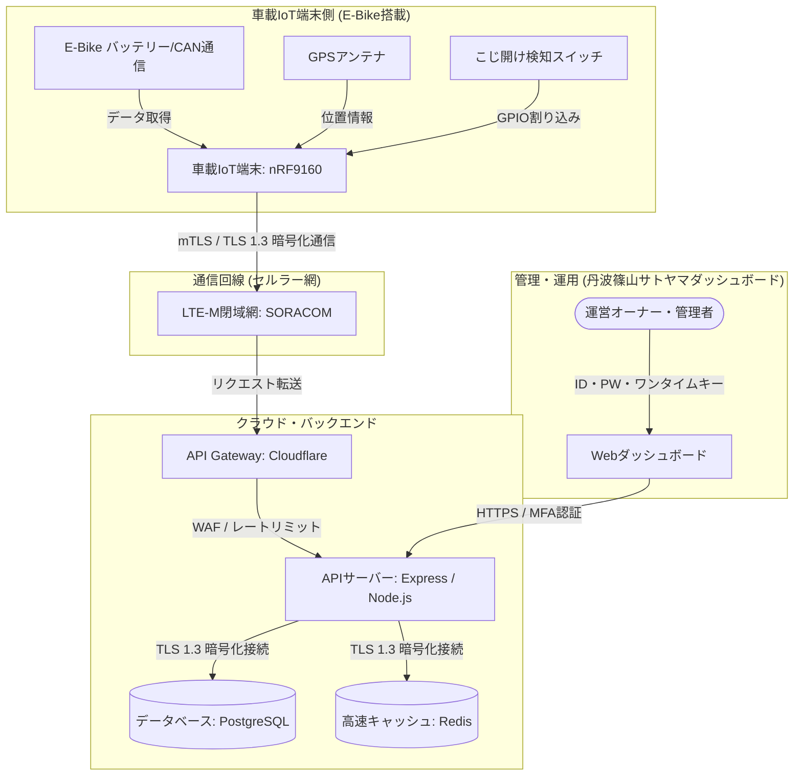

# 遠隔バッテリー・位置情報管理システム セキュリティ仕様 & 防御設計書

> [!IMPORTANT]
> 本書は、兵庫県丹波篠山市のサトヤマ（里山）地域における電動アシスト自転車（パナソニック・ヤマハ製対応）の遠隔バッテリー監視およびリアルタイムGPS位置追跡システムを対象とした、包括的なセキュリティ仕様書です。
> 非エンジニアの運営オーナー様向けに「対策の目的と価値」を分かりやすく示しつつ、開発・ハードウェアチームがそのまま実装に落とし込める「具体的かつ数値的な暗号化技術、IC型番、プロトコル仕様」を規定しています。

---

## 1. 全体セキュリティアーキテクチャと脅威モデル

本システムは、車載IoT端末からクラウドサーバー、データベース、管理ダッシュボードに至るまで、多様な環境を経由してデータが流れます。それぞれの境界で発生し得る脅威を可視化し、適切な防衛網を敷く「多層防御（Defense-in-Depth）」の考え方を採用します。

### 1.1 エンドツーエンド（E2E）システムデータフロー



### 1.2 脅威分析マトリックス

本システムで想定される主なセキュリティ上の脅威と、それらが発生した場合のビジネス・運用上の影響度を定義します。

| # | 脅威の分類 | 脅威の具体的内容 | 影響度 | 発生時の損害・ビジネスリスク | 対策の優先度 |
| :--- | :--- | :--- | :--- | :--- | :--- |
| **T-1** | **物理・端末** | 駐輪中のE-BikeからIoT端末が盗難・分解され、基板のデバッグ端子（JTAG）から制御ファームウェアや通信用のセキュリティキーが吸い出される。 | **極めて高い** | ・全端末共通のセキュリティキーが漏洩した場合、クローン端末を偽造され、システム全体への不正アクセスを許す。<br>・E-Bikeの遠隔起動や不正な位置データの送信が可能になる。 | **最高 (P0)** |
| **T-2** | **通信・回線** | 通信経路上の電波やネットワークが傍受（盗聴）され、位置情報ログやバッテリー情報が第三者に筒抜けになる。また、過去の正常なデータをキャプチャして何度も送りつける「リプレイ攻撃」により、現在の状態が隠蔽される。 | **高い** | ・利用客の移動経路（いつ、どこを走っていたか）が筒抜けになり、重大なプライバシー侵害が発生する。<br>・バッテリー切れ寸前なのに「100%」という古い偽データを送りつけられ、現場で立ち往生する観光客が発生する。 | **高 (P1)** |
| **T-3** | **API・サーバー** | 競合や悪意ある攻撃者により、APIエンドポイント（`/api/v1/telemetry`）に対して毎秒数万回のリクエスト（DDoS攻撃）が送りつけられ、システムが停止する。 | **高い** | ・ダッシュボードが閲覧不能になり、どのE-Bikeがどこでバッテリー切れを起こしているか把握できなくなる。<br>・サーバー維持費（クラウド使用料）が跳ね上がる。 | **高 (P1)** |
| **T-4** | **データベース** | APIの入力フォームや通信データに悪意あるスクリプト（SQL）を混入させ、データベース内の全車両データやログを書き換え・削除・盗難される（SQLインジェクション）。 | **極めて高い** | ・車両データ、位置履歴、およびメンテナンス日誌がすべて消去され、日常のレンタル事業の運営が麻痺する。 | **最高 (P0)** |
| **T-5** | **プライバシー** | GPSログの流出により、特定の観光客が丹波篠山の「いつ、どの店や場所を訪れ、どこに宿泊したか」が完全に特定されてしまう。 | **高い** | ・個人情報保護法（APPI）やGDPRに違反し、自治体や観光協会としての信頼が完全に失墜する。<br>・多額の賠償金や制裁金が科されるリスク。 | **最高 (P0)** |

---

## 2. 車載IoT端末の物理・ハードセキュリティ仕様

車載IoT端末は常に屋外に置かれ、盗難やイタズラ、分解の脅威にさらされています。本セクションでは、デバイス内部の機密データ（ファームウェア、暗号鍵、証明書）を物理的および論理的に保護するハードウェアセキュリティ設計を規定します。

### 2.1 筐体開閉検知（物理こじ開けアラート）とメモリ自己破壊（ゼロ化）

IoT端末のケースがドライバーなどでこじ開けられた瞬間を検知し、内部のセキュリティ情報を物理的に防衛します。

```
[筐体こじ開けの発生]
      ↓
(物理的にスイッチが解放される / 信号ラインが LOW になる)
      ↓
[OMRON製 D2FS-F-N マイクロスイッチ検知]
      ↓
[nRF9160 の GPIO 割り込みピン (Active Low) が検知]
      ↓
┌───────────────────────┴───────────────────────┐
↓ (処理A)                                       ↓ (処理B)
【LTE-M経由で即座にクラウドへ送信】             【TrustZone内の秘密鍵・証明書を自己破壊】
・「端末ID: EB-TANBA-001」                    ・SRAM/セキュアFlash上の
・「アラート: 物理こじ開け検知」               「暗号鍵およびmTLS証明書」を
・「現在GPS座標: 35.0748, 135.2189」           「0x00」で上書き消去（ゼロ化）
```

#### 2.1.1 筐体開閉検知回路と動作仕様
- **ハードウェア部品**: 基板上の筐体接触部に **OMRON製極超小形マイクロスイッチ D2FS-F-N**（スナップアクション型、高耐久・防塵仕様）または超小型フォトリフレクタを配置。
- **電気的設計**: 筐体が閉じているときはスイッチが押されて回路が「閉（High）」、開けられるとスイッチが戻って「開（Low）」になる Active Low 回路を構成。この出力を **nRF9160** の超低消費電力ウェイクアップ対応GPIOピン（ポート0）に直接接続。
- **緊急通知アクション**:
  1. **LTE-M即時送信**: 筐体の開放イベントを検知すると、nRF9160は省電力スリープモードを瞬時に中断し、即座にGPSの最新座標を内蔵GPS/LTEアンテナ経由でLTE-M網へ送出。APIサーバーに対し「`X-Tamper-Alert: true`」のヘッダーを持つ緊急アラートパケットを送信する。
  2. **秘密情報のゼロ化（Zeroization）**: 万が一通信が届かない状況であっても、ファームウェアのクローンや鍵の吸い出しを防ぐため、セキュア領域に格納されている「デバイス固有秘密鍵（ECDSA P-256）」および「mTLSクライアント証明書」を保持する不揮発性SRAM/Secure Flash領域に対して、瞬時に「`0x00`」のビットパターンを書き込み、メモリを完全に物理消去（ゼロ化）する。これにより、端末は「ただの文鎮（クローン不可能なゴミ）」と化し、攻撃者はシステムへの侵入パスを失う。

### 2.2 JTAG/UARTデバッグ端子の無効化

開発段階で使用する「デバッグポート（JTAG/SWD）」は、ハッカーがファームウェアを吸い出すための最大の抜け穴になります。量産出荷時にこれらを物理的かつ電気的に完全に閉鎖します。

1. **eFuse（エレクトロニック・フューズ）のブローによるデバッグアクセス無効化（APPROTECTの適用）**:
   - nRF9160には、デバッグポートからのアクセスを禁止するハードウェア保護機能「**APPROTECT (Access Port Protection)**」が備わっています。
   - 工場でのファームウェア最終書き込み時、不揮発性レジスタ（UICR: User Information Configuration Registers）の `APPROTECT` レジスタに無効化フラグを書き込み、内部の物理フューズ（eFuse）を電気的に焼き切ります。これにより、外部からSWD（Serial Wire Debug）プローブを物理的に接続しても、二度と内部フラッシュメモリのデータを読み出せないようにハードウェアレベルで永久ロックします。
2. **基板（PCB）物理レイアウトの防護策**:
   - UART（TX/RX）やSWD（CLK/DIO）のテストポイント（基板上の金属端子）は、すべて基板の表面（外層）に露出させず、**中間層（内層配線: Buried Via）** に埋め込む設計とします。
   - 量産基板では、不要なデバッグピンの周辺パターンをルーターやカッターで物理的にカットできる「スリット・パターンカットライン」を設け、工場出荷検査合格の直後に物理的にパターンを削り取ります。

### 2.3 nRF9160 (Cortex-M33) TrustZoneを用いたセキュリティキー管理

本システムの車載IoT端末の頭脳である **Nordic Semiconductor nRF9160**（Arm Cortex-M33プロセッサ搭載）には、スマートフォンと同等のセキュリティを実現するハードウェア分離技術「**Arm TrustZone-M**」が標準搭載されています。これを最大限に活用します。

```
  ┌─────────────────────────────────────────────────────────────┐
  │                   nRF9160 (Cortex-M33)                      │
  │                                                             │
  │  【ノンセキュア領域 (Non-Secure)】    【セキュア領域 (Secure)】   │
  │  ┌─────────────────────────────┐   ┌─────────────────────┐  │
  │  │  一般アプリケーション領域      │   │ TrustZone セキュアOS │  │
  │  │                             │   │                     │  │
  │  │  ・GPS座標の取得             │   │ ・暗号鍵の保管 (Kpub)│  │
  │  │  ・バッテリー残量(SoC)取得  │   │ ・mTLS証明書の管理  │  │
  │  │  ・CAN通信制御              │   │                     │  │
  │  └──────────────┬──────────────┘   └──────────▲──────────┘  │
  │              │                            │                 │
  │              │ NSC (セキュアゲートウェイ)  │                 │
  │              └────────────────────────────┘                 │
  │                                                               │
  │    [ハードウェア暗号エンジン: Arm CryptoCell-310 (TRNG搭載)]    │
  └─────────────────────────────────────────────────────────────┘
```

- **論理的・物理的メモリ分離（TrustZone-M）**:
  - メモリおよび周辺機能を、一般処理を行う「ノンセキュア領域（Non-Secure）」と、機密情報を扱う「セキュア領域（Secure）」にハードウェアレベルで完全分離します。
  - バッテリー制御やGPSデータ処理などのメインアプリケーションはノンセキュア領域で動作させ、暗号アルゴリズムの実行や暗号鍵の保持はセキュア領域でのみ実行します。
  - ノンセキュア領域からセキュア領域のメモリを直接読み出すことはCPUのハードウェア仕様として不可能であり、アクセスはあらかじめ定義された安全なAPI（NSC: Non-Secure Callable）経由での呼び出しに限定されます。
- **ハードウェア暗号アクセラレータ「Arm CryptoCell-310」の活用**:
  - nRF9160に内蔵された **CryptoCell-310** 暗号エンジンを使用します。
  - デバイス固有の「秘密鍵（ECC P-256 / SHA-256対応）」は、CryptoCell内のセキュアキーレジスタに生成・格納されます。この鍵はCPUのプログラムから直接読み出すことができず、署名生成要求を送ると、暗号モジュール内部で署名（デジタルサイン）だけが生成されて戻る仕組みになっています（鍵の完全秘匿）。
  - **TRNG（真性乱数生成器）**: 暗号や通信で使用する「ワンタイムのランダム値（Nonce）」や暗号シークレットは、CryptoCell-310のTRNGが生成する物理的な熱ノイズ等をソースとする予測不可能な本物の乱数を使用し、乱数の予測攻撃を防ぎます。
- **セキュアブート（MCUboot）の強制**:
  - 電源投入時、セキュアROMに書き込まれた改ざん不可能な「マスター公開鍵」を用いて、これから起動するファームウェアの署名を検証します。
  - 攻撃者がファームウェアのバグを利用して偽のファームウェアを書き込んでも、デジタル署名が不一致となるため端末は起動せず、不正なプログラムの実行を未然に防止します。

---

## 3. 通信プロトコルの暗号化と多層防御仕様

IoT端末からクラウドサーバーへのデータ送信において、インターネット上での通信傍受、改ざん、および過去のデータを利用したなりすまし攻撃を防ぐ設計を定義します。

### 3.1 ネットワークトポロジーとLTE-M閉域網の採用

本システムでは、パブリックなインターネット上にIoT端末のポートを一切露出させない設計を基本とします。

- **SORACOMセルラー通信網の採用**:
  - IoT通信プラットフォームである **SORACOM（LTE-M）** を採用。各端末には専用のSORACOM IoT SIMを装着します。
  - **閉域網接続（SORACOM Canal/Canal-Transit）**: セルラー基地局からSORACOMのコアネットワークを経由し、AWS等のクラウドサーバー（API Gateway）までをインターネットを経由しないプライベートピアリング（閉域VPN接続）で直結します。
  - これにより、世界中のハッカーからIoT端末に直接スキャンやポートアタックを仕掛ける経路を完全に遮断します。

### 3.2 TLS 1.3の完全強制

パブリックな通信経路を使用する場合、または閉域網内でのセキュリティをさらに強化するため、業界最高水準の暗号化プロトコル **TLS 1.3（RFC 8446）** を強制します。

- **TLS 1.3の強制**: TLS 1.2以下の使用をAPIサーバー側で完全に禁止します。TLS 1.3は、ハンドシェイク（通信開始の手順）を1往復（1-RTT）で完了させるため、電波状況が不安定な丹波篠山の山間部におけるLTE-M通信でも遅延を劇的に削減するメリットがあります。
- **暗号スイート（Cipher Suites）の限定**:
  サーバーおよび端末側で以下の最新かつ強力な暗号方式のみを許可します。
  - `TLS_AES_256_GCM_SHA384`（推奨）
  - `TLS_CHACHA20_POLY1305_SHA256`（CPU負荷の低いnRF9160に最適）
- 脆弱性のある古い暗号（DES, RC4, MD5, SHA-1, CBCモードのAES）は完全に無効化します。

### 3.3 端末個別mTLS（Mutual TLS）認証とHMAC二重検証

現在実装されている「単一の固定APIキー（`X-Device-API-Key`）」による認証は、1台のデバイスが破られた場合に全端末が偽装されるため廃止し、以下のハイブリッド防衛策に移行します。

#### 3.3.1 デバイス個別mTLS (相互TLS) 認証
各IoT端末に固有のデジタル証明書（X.509）を持たせ、サーバーと端末が「お互いに相手が本物であること」を確認した上で通信を確立します。

- **PKI（公開鍵暗号基盤）の構築**: AWS Private CA等のプライベート認証局を構築し、各端末のIMEI（製造番号）をサブジェクト名に含んだクライアント証明書を出荷時にnRF9160のセキュア領域に書き込みます。
- **クライアント証明書検証**: API Gateway（CloudflareまたはAWS ALB）にてクライアント証明書の検証を処理し、有効な証明書を持たない端末からのTCP接続要求はAPIサーバーに到達する前に即座に切断します。

#### 3.3.2 HMAC-SHA256署名によるデータ改ざん・リプレイ攻撃防止
mTLSに加え、あるいはネットワーク中継器の制約等でmTLSが使用できない場合の「アプリケーションレイヤーでの確実な防護」として、**HMAC-SHA256署名を用いた改ざん防止・リプレイ攻撃（同じ通信の再送）対策**を定義します。

```
【IoT端末側での署名作成フロー】
1. テレメトリデータを用意
   (deviceId, batterySoc, batteryVoltage, currentLat, currentLng, status)
2. 送信用Nonce(ランダム文字列)とTimestamp(現在エポック秒)を生成
3. これらをカンマで連結し、「署名対象文字列」を作成:
   "EB-TANBA-001,85,25200,35.0748,135.2189,available,1779696400,a8f9c2d3b4e5f678"
4. TrustZone内の秘密共有キー(K_shared)を使って、HMAC-SHA256 を計算:
   HMAC-SHA256(K_shared, 署名対象文字列) = "5f4dcc3b5aa76..."
5. 以下のヘッダーおよびボディでPOST送信
```

##### 送信仕様（HTTPリクエスト例）
```http
POST /api/v1/telemetry HTTP/1.1
Host: api.satoyama-ebike.tanbasashiyama.jp
Content-Type: application/json
X-Device-ID: EB-TANBA-001
X-Device-Timestamp: 1779696400
X-Device-Nonce: a8f9c2d3b4e5f678
X-Device-Signature: 5f4dcc3b5aa765d61d8327deb882cf99a8f9c2d3b4e5f678efcd9876543210ab

{
  "deviceId": "EB-TANBA-001",
  "batterySoc": 85,
  "batteryVoltage": 25200,
  "currentLat": 35.0748,
  "currentLng": 135.2189,
  "status": "available"
}
```

##### サーバー側での検証検証シーケンス（Node.js/Express擬似コード）
```typescript
import { Request, Response, NextFunction } from 'express';
import crypto from 'crypto';
import { redisClient } from '../config/redis'; // 高速キャッシュ

export const verifyDeviceSignature = async (req: Request, res: Response, next: NextFunction) => {
  const deviceId = req.header('X-Device-ID');
  const timestampStr = req.header('X-Device-Timestamp');
  const nonce = req.header('X-Device-Nonce');
  const signature = req.header('X-Device-Signature');

  if (!deviceId || !timestampStr || !nonce || !signature) {
    return res.status(401).json({ error: 'Unauthorized', message: 'Missing security headers.' });
  }

  // 1. タイムスタンプ制限（リプレイ対策1：許容範囲は現在時刻から±60秒）
  const timestamp = parseInt(timestampStr, 10);
  const now = Math.floor(Date.now() / 1000);
  if (Math.abs(now - timestamp) > 60) {
    return res.status(401).json({ error: 'Unauthorized', message: 'Request expired (Timestamp delta > 60s).' });
  }

  // 2. Nonceの重複チェック（リプレイ対策2：Redisを利用し、過去24時間以内に同一Nonceがないか確認）
  const nonceKey = `nonce:${deviceId}:${nonce}`;
  const isNonceExists = await redisClient.get(nonceKey);
  if (isNonceExists) {
    return res.status(401).json({ error: 'Unauthorized', message: 'Replay attack detected (Nonce already used).' });
  }
  // 使用されたNonceを24時間（86400秒）Redisに保存
  await redisClient.set(nonceKey, '1', 'EX', 86400);

  // 3. データベース等から該当デバイスの共有暗号キー(マスターキーで保護されたもの)を取得
  const sharedKey = await getDeviceSharedKey(deviceId); 

  // 4. 送信時と全く同じルールで署名対象文字列を再現
  const body = req.body;
  const rawString = [
    body.deviceId,
    body.batterySoc,
    body.batteryVoltage,
    body.currentLat,
    body.currentLng,
    body.status,
    timestampStr,
    nonce
  ].join(',');

  // 5. サーバー側でHMAC-SHA256署名を計算
  const computedSignature = crypto
    .createHmac('sha256', sharedKey)
    .update(rawString)
    .digest('hex');

  // 6. 送信されてきた署名と安全に比較（タイミング攻撃を防ぐため定数時間比較を使用）
  if (!crypto.timingSafeEqual(Buffer.from(signature, 'hex'), Buffer.from(computedSignature, 'hex'))) {
    return res.status(401).json({ error: 'Unauthorized', message: 'Invalid payload signature.' });
  }

  next();
};
```

---

## 4. APIサーバーとデータベースのセキュリティ仕様

データが集約されるクラウドサーバーおよびデータベースの堅牢性を担保し、不正アクセスやデータ漏洩を防ぎます。

### 4.1 DDoS・総当たり攻撃防御（レートリミット設計）

悪意あるトラフィックによるサーバー過負荷を防ぎ、システムの稼働率を維持します。

- **レートリミットポリシー**:
  E-Bike端末は通常1分間に1回の周期でテレメトリデータを送信します。突発的なリトライを考慮し、以下のポリシーをAPI Gateway（Cloudflare等）およびNginx（リバースプロキシ）レベルで強制します。
  - **テレメトリAPI (`POST /api/v1/telemetry`)**: 
    - **1デバイスあたり**: 「1分間に最大2リクエスト、バースト最大5リクエスト」までに制限。
    - **同一IPアドレスあたり**: 接続されている最大自転車数に基づき、余裕を持たせた上限値を設定。
    - **超過時の挙動**: 上限を超えたリクエストには `HTTP 429 Too Many Requests` を返し、悪質な連続アクセスの場合は自動的にそのIPからの通信を1時間遮断します。
  - **ダッシュボードAPI（管理者ログイン等）**:
    - **同一IPあたり**: 「1分間に最大10リクエスト」。ブルートフォース（総当たり）ログイン試行を徹底的に抑え込みます。

### 4.2 APIキー・認証情報の暗号化と自動ローテーション

データベース内に格納するデバイスの共有シークレットや、サーバーの接続パスワードを厳重に管理します。

- **機密情報の暗号化保管**:
  - デバイスごとのHMAC共有シークレットは、データベース（PostgreSQL）内にプレーンテキスト（生の文字）のまま保存しません。
  - クラウドのキー管理サービス（AWS KMS等）が保有するマスター鍵を用い、**AES-256-GCM**で暗号化したバイナリデータとしてテーブルに格納します。
- **シークレットの自動ローテーション**:
  - API通信に必要な認証トークンやキーは、**180日周期で自動的に更新（ローテーション）** されます。
  - 期限が切れる前に、サーバーからデバイスのTrustZone内セキュア領域に対し、閉域回線経由で新しい鍵の生成と共有を要求するセキュア更新シーケンスをバックグラウンドで自動実行します。

### 4.3 安全なデータ処理（SQLインジェクション完全防止）

攻撃者が悪意あるクエリを紛れ込ませてデータベースを操作する古典的かつ極めて危険な攻撃を、ソースコードの設計ルールで徹底防御します。

- **Prisma ORMによるプレースホルダ処理の義務化**:
  - 本システムではバックエンドのデータベース操作に **Prisma ORM** を採用しています。
  - `prisma.vehicle.create` や `prisma.telemetryLog.create` といったPrismaの標準クエリAPIを使用する限り、Prismaが内部的にSQLパラメタライズ（プリペアドステートメント）を適用するため、SQLインジェクションは原理的に発生しません。
  - > [!CAUTION]
  > **絶対禁止ルール**: Prismaの生のSQL実行機能である `prisma.$queryRaw` または `prisma.$executeRaw` を使用して、文字列連結（例：`"SELECT * FROM vehicles WHERE id = " + inputId`）によるクエリを記述することを開発基準で**完全禁止**とします。動的クエリが必要な場合は、必ずテンプレートリテラルによるプレースホルダ表記（``prisma.$queryRaw`SELECT * FROM vehicles WHERE id = ${inputId}` ``）を徹底します。
- **バリデーションフレームワークによる厳格な型制限**:
  - `class-validator`（`TelemetryDto`）を用いて、APIに入力されるすべての値をコントローラ到達前に厳密にフィルタリングします。
  - 例：`batterySoc` は整数かつ `0 <= SoC <= 100` であること、`currentLat` / `currentLng` は浮動小数点数かつ現実的な世界座標内であることを強制します。

### 4.4 データベース・キャッシュ間のTLS暗号化接続の強制

クラウド内部のプライベートネットワークであっても、サーバー間の通信の盗聴リスク（他のコンテナや仮想マシンの侵入）を排除するため、すべての内部通信を暗号化します。

- **APIサーバー ⇔ PostgreSQL（データベース）**:
  - PostgreSQLの接続設定において **`sslmode=verify-full`** を強制します。
  - APIサーバーは、PostgreSQLサーバーのルートCA証明書を保持し、ドメイン名と証明書が完全に一致することを検証した上でTLS 1.3接続を行います。平文での接続（非SSLポートへの接続）はPostgreSQL側で拒否（`pg_hba.conf`にて `hostssl` のみ許可）します。
- **APIサーバー ⇔ Redis（高速キャッシュ）**:
  - Redisとの接続時にも **TLS (rediss:// プロトコル)** を強制し、インメモリデータの転送過程での盗聴を防ぎます。
- **認証資格情報の環境変数・シークレットマネージャ管理**:
  - データベースのパスワードやRedisのアクセスキーは、Git管理下のソースコード（`package.json` や `index.ts` 等）に絶対に記述しません。
  - 本番環境では環境変数ファイル（`.env`）も廃止し、クラウド環境の **シークレットマネージャ（AWS Secrets ManagerやDocker Secrets）** から直接コンテナのメモリ空間へ安全に注入します。

---

## 5. 丹波篠山での運用におけるプライバシー保護とダッシュボード管理仕様

丹波篠山（サトヤマ）でのE-Bike事業において、観光客や地域住民のプライバシー（行動履歴）を守り、個人情報保護法（APPI）および国際基準（GDPR）に準拠した運用基準を定めます。

### 5.1 GPS位置情報の秘匿化設計（データ・マスキングとノイズ付加）

高精度なGPS位置情報は、個人の自宅位置や行動ルートを特定できる「個人データ（準個人情報）」に該当します。この情報をビジネスの必要性に応じて段階的に隠蔽（マスキング）します。

```
【収集された高精度GPSデータ】 (例: 35.074823, 135.218942 / 精度 0.1m)
            │
            ├─► [一般ダッシュボード画面表示時]
            │   小数点以下4桁に切り捨て (35.0748, 135.2189 / 精度約11m) ─► 【個人の特定を防止】
            │
            ├─► [観光分析用データの出力時]
            │   ・ユーザーID(IMEI)をソルト付きSHA-256でハッシュ化
            │   ・トリップ開始/終了地点の200m圏内データを自動削除 (プライバシー・ジオフェンス)
            │
            └─► [データベース保管寿命制限]
                ・生GPSログは「最大90日間」で自動消去
                ・それ以降は統計情報(例: 「特定エリアの1時間の通行台数」)に完全匿名化
```

1. **画面表示時のデータ・マスキング**:
   - 通常の運用監視ダッシュボード（どのエリアに車両が配置されているか）では、GPSの座標値を**小数点以下4桁**（精度約11m）に丸めて表示します。小数点以下5〜6桁（精度1m以下）の高精度データは表示せず、観光客が立ち寄った正確な民家や店舗を特定できないようにします。
2. **観光分析データへのノイズ付加（プライバシー・ジオフェンス）**:
   - 丹波篠山市の観光動態分析（どのルートが人気か）にデータを二次利用する際は、自転車の「出発地（ホテルの前など）」および「目的地（特定の飲食店や宿泊先）」から**半径200メートル以内のGPSデータを除外（マスク）**した上で提供します。これにより、観光客の宿泊先や特定の個人宅の特定を防ぎます。
   - デバイスの識別番号（IMEI）は、日替わりのランダムな「ソルト（塩）値」を付加した上で **SHA-256** でハッシュ化し、日をまたいだ同一人物の長期的な行動追跡を不可能にします。
3. **データ保存寿命の制限（90日間自動消去ポリシー）**:
   - 個々の走行ルートが記録された生テレメトリログ（時系列位置ログ）の保存期間は **最大90日間** に制限します。
   - 90日を経過した古いログは、データベースの定期実行ジョブ（Cronジョブ）によって「車両ID（IMEI）」などの個別識別子を完全に削除し、エリアごとの「通過台数統計（例：土曜日の午前にサトヤマエリアをE-Bikeが合計15台通過した）」という**完全な統計（匿名加工）データ**へ変換した上で、生の個別ログを自動で物理削除します。

### 5.2 ダッシュボード（Satoyama Admin Dashboard）のアクセス制御

丹波篠山観光協会のスタッフやメンテナンス委託業者など、権限に応じた厳格な操作制限を行います。

- **ロールベースアクセス制御（RBAC）の実装**:
  ダッシュボードへのログインユーザーに対し、以下の3つの権限ロールを設定し、不要な情報へのアクセスを遮断します。

  | ロール名 | 権限範囲 | 表示可能なデータ・可能な操作 |
  | :--- | :--- | :--- |
  | **SuperAdmin**<br>(システム管理者) | システム全権 | ・すべての設定変更<br>・ユーザー（スタッフ）のアカウント発行・削除<br>・全ログのダウンロード |
  | **Operator**<br>(観光協会スタッフ・整備員) | 現場運用・車両整備 | ・車両の位置確認（マスキング済み）<br>・バッテリーSoCの確認（充電切れ回収用）<br>・メンテナンス日誌（タイヤ交換、バッテリー交換等）の起票・編集 |
  | **Analyst**<br>(観光分析・行政担当者) | 観光統計分析 | ・個人特定不可能な「統計加工済み」の通行データ・ヒートマップの閲覧のみ<br>・生データや車両のリアルタイム位置追跡はアクセス不可 |

- **多要素認証（MFA: Multi-Factor Authentication）の完全義務化**:
  - 管理者アカウントがハッキングされ、車両の位置情報が流出するのを防ぐため、IDとパスワードの入力に加え、スマートフォンアプリ（Google Authenticator等）に表示される30秒間だけ有効なワンタイムパスワード（TOTP）の入力を必須とします。
- **セッションタイムアウト**:
  - 管理者がPCを開いたまま席を離れた場合の盗み見を防ぐため、**15分間**操作がない場合は自動的にセッションを破棄し、強制ログアウトさせます。
- **監査ログ（変更証跡）の取得**:
  - ダッシュボード上でのすべての「ユーザーログイン」「メンテナンス記録の書き換え」「車両情報の編集」といった操作は、APIサーバー経由で「操作したスタッフのID」「IPアドレス」「操作内容」「日時」を、システム管理者であっても削除・改ざんできない「追記専用の監査ログデータベース（AWS CloudWatch Logs等）」に即時書き込みます。

### 5.3 ダッシュボード画面へのHTTPS強制とブラウザセキュリティ

- **常時SSL/TLS（HTTPS）の強制**:
  - ダッシュボードのWebサーバー（ポート80: HTTP）へのアクセスは、ロードバランサー（あるいはNginx）で直ちに `HTTP 301 Moved Permanently` を返し、安全な **HTTPS（ポート443）へ強制リダイレクト** します。
- **セキュリティHTTPヘッダーの適用**:
  ブラウザの脆弱性や中間者攻撃を防御するため、ダッシュボードの応答ヘッダーに以下を設定します。

```http
Strict-Transport-Security: max-age=63072000; includeSubDomains; preload
Content-Security-Policy: default-src 'self'; script-src 'self' https://trusted-cdn.com; object-src 'none'; frame-ancestors 'none';
X-Frame-Options: DENY
X-Content-Type-Options: nosniff
Referrer-Policy: strict-origin-when-cross-origin
```

*※それぞれのヘッダーの意味：*
- **HSTS (Strict-Transport-Security)**: 今後2年間、このダッシュボードには必ず暗号化通信（HTTPS）で接続するようユーザーのブラウザに強制します（HTTP接続の完全排除）。
- **CSP (Content-Security-Policy)**: ダッシュボード上で許可されていない不正な外部スクリプトの実行をブラウザ側で禁止し、XSS（クロスサイトスクリプティング）によるクッキー（認証セッション）盗難を防ぎます。
- **X-Frame-Options: DENY**: 他の偽Webサイトの「背景（透明な枠）」としてダッシュボードを埋め込まれることを防ぎ、管理者が騙されてボタンを押してしまう「クリックジャッキング攻撃」を防止します。
- **X-Content-Type-Options: nosniff**: ブラウザがファイル形式を勝手に推測して実行するのを防ぎ、アップロードされた画像などに偽装された不正プログラムの実行を防ぎます。

---

## 6. セキュリティ実装・運用ロードマップ & チェックリスト

本仕様書で定義されたセキュリティ防護策を、各開発・運用フェーズにおいて確実に実行するためのロードマップとセルフチェックリストです。

### 6.1 実装・製造・運用フェーズチェックリスト

#### ☐ 【フェーズ1】IoTハードウェア・ファームウェア開発（出荷前）
- [ ] **物理こじ開け検知**: OMRON製マイクロスイッチ `D2FS-F-N` の信号が、nRF9160のGPIOピン（Active Low）で検知されることを確認したか。
- [ ] **自己破壊仕様**: こじ開け割り込みが発生した際、SRAM/セキュアFlash内のクライアント証明書および鍵データが即座に `0x00` で上書き消去されることを実機テストしたか。
- [ ] **JTAGロック**: UICRの `APPROTECT` レジスタの設定が行われ、eFuseによるSWD/JTAGポートの読み出し無効化プロセスが量産製造治具に組み込まれているか。
- [ ] **TrustZone分離**: 暗号処理、共有シークレット、および証明書がセキュア領域に配置され、ノンセキュア側からはNSC経由でのみ機能呼び出しされているか。
- [ ] **セキュアブート**: `MCUboot` が有効化され、署名検証されていないファームウェアで起動しない設定になっているか。

#### ☐ 【フェーズ2】通信・回線設計（結合テスト時）
- [ ] **閉域網構成**: SIM（SORACOM等）からAPIサーバーへの経路が閉域網（Canal）経由で結ばれており、インターネットからの直接アクセスが遮断されているか。
- [ ] **TLS 1.3の強制**: 端末・サーバー間の通信がTLS 1.3かつ推奨暗号スイート（`TLS_AES_256_GCM_SHA384` 等）に制限されているか。TLS 1.2以下での接続テストが正しく拒否されるか。
- [ ] **HMAC署名検証**: `X-Device-Signature` によるHMAC-SHA256署名検証がサーバー側で実装され、データ改ざんや認証キーのなりすましが検知されて `401 Unauthorized` を返すか。
- [ ] **リプレイ対策**: 送信されてきた `X-Device-Timestamp` が現在時刻と60秒以上離れている場合、および `X-Device-Nonce` がRedisで過去に使用済みの場合に、リクエストが安全に拒否されるか。

#### ☐ 【フェーズ3】APIサーバー & データベース構築（デプロイ前）
- [ ] **レートリミット設定**: テレメトリAPIに対して、デバイス当たり「1分間に2リクエスト、バースト5」の制限がCloudflare / Nginx等に設定されているか。
- [ ] **SQLインジェクション完全防止**: Prisma ORMを使用し、生のSQLクエリでの文字列連結（`+ input` 等）が一切行われていないこと、すべてパラメタライズドクエリで処理されていることをコード監査したか。
- [ ] **データベースSSL接続**: APIサーバーとPostgreSQL’の接続において、接続文字列に `sslmode=verify-full` が指定され、相互TLS接続が強制されているか。
- [ ] **シークレット管理**: パスワードや鍵などの環境変数が、Git管理下に漏洩していないこと、およびシークレットマネージャから読み込まれていることを確認したか。

#### ☐ 【フェーズ4】ダッシュボード運営（日常運用フェーズ）
- [ ] **GPSマスキング**: 通常ダッシュボードでの表示において、GPSデータが小数点以下4桁に丸められて処理されているか。
- [ ] **プライバシー・ジオフェンス**: 観光統計分析用データの出力時、トリップ開始・終了地点の200m圏内の座標データが自動的に削除されるアルゴリズムが動作しているか。
- [ ] **ログ自動消去**: 90日を経過した古い生GPSログを、データベースから自動で物理消去または完全統計化するCronバッチ処理が稼働しているか。
- [ ] **RBACとMFA**: 管理スタッフアカウントに「SuperAdmin」「Operator」「Analyst」の権限分離（RBAC）が適用され、全ユーザーに多要素認証（MFA）の設定が完了しているか。
- [ ] **HTTPS常時接続とHSTS**: ポート80（HTTP）での接続がHTTPSへ自動で恒久リダイレクトされること、およびHSTS、CSP、X-Frame-Optionsなどの主要セキュリティヘッダーがレスポンスに含まれているか。

---
*本書に定義されたセキュリティ仕様は、パナソニック・ヤマハ対応 遠隔バッテリー・位置情報管理システムにおけるエンドツーエンドの安全性を担保する設計基準です。開発チームおよびハードウェア製造ベンダーは、本仕様書の内容を遵守して実装を進めてください。*
